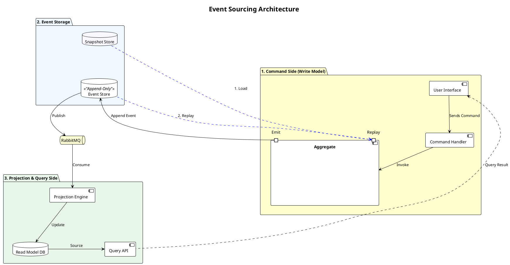
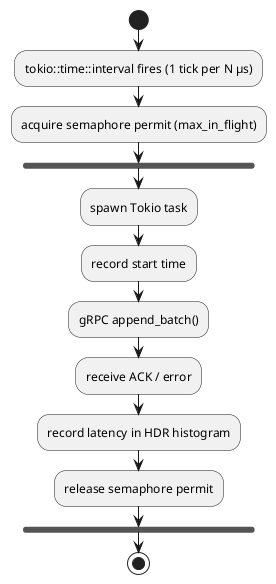
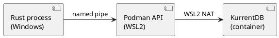

# POC: Event sourcing on Edge Architecture

---

**Author**: `Michael Wild [Senior SW Engineer]`

**Modification history:**

- **v1.0** by wildm3: 19-May-2026 - Initial version

---

- [POC: Event sourcing on Edge Architecture](#poc-event-sourcing-on-edge-architecture)
  - [Introduction \& Scope](#introduction--scope)
    - [Event Sourcing Architecture Diagram](#event-sourcing-architecture-diagram)
    - [Out of Scope](#out-of-scope)
  - [Links and References](#links-and-references)
  - [Terms and Definitions](#terms-and-definitions)
  - [Problem Statement / Executive Summary](#problem-statement--executive-summary)
    - [Acceptance Criteria](#acceptance-criteria)
  - [Chosen Scenarios](#chosen-scenarios)
    - [Non-Functional Requirements Comparison](#non-functional-requirements-comparison)
    - [Scenario 1: Dedicated — KurrentDB](#scenario-1-dedicated--kurrentdb)
    - [Scenario 2: Platform-Integrated — Axon Server](#scenario-2-platform-integrated--axon-server)
    - [Scenario 3: Relational — PostgreSQL / MySQL](#scenario-3-relational--postgresql--mysql)
    - [Scenario 4: NoSQL — MongoDB](#scenario-4-nosql--mongodb)
    - [Scenario 5: RabbitMQ Streams](#scenario-5-rabbitmq-streams)
    - [Benchmark Architecture](#benchmark-architecture)
    - [Why the Testbed Uses No ES Framework Libraries](#why-the-testbed-uses-no-es-framework-libraries)
  - [DB Choice](#db-choice)
    - [Complexity Details](#complexity-details)
    - [Needed Functionality](#needed-functionality)
      - [Consistency Primitives](#consistency-primitives)
      - [Functional Needs](#functional-needs)
    - [Further Options](#further-options)
    - [Proposed Stack](#proposed-stack)
  - [Supporting Libraries \& Services](#supporting-libraries--services)
    - [Core Libraries](#core-libraries)
    - [Observability \& Tooling](#observability--tooling)
  - [Next Steps](#next-steps)
    - [1. Initial Decision — Scenarios to Analyse in Depth](#1-initial-decision--scenarios-to-analyse-in-depth)
    - [2. Define and Analyse Best Setup for the choosen Scenarios](#2-define-and-analyse-best-setup-for-the-choosen-scenarios)
      - [KurrentDB (Scenario 1)](#kurrentdb-scenario-1)
      - [Axon Server (Scenario 2)](#axon-server-scenario-2)
      - [PostgreSQL (Scenario 3)](#postgresql-scenario-3)
      - [MongoDB (Scenario 4)](#mongodb-scenario-4)
      - [RabbitMQ Streams (Scenario 5)](#rabbitmq-streams-scenario-5)
    - [3. Test Chosen Setups Against the Baseline](#3-test-chosen-setups-against-the-baseline)
    - [4. Define More Realistic SLA Scenarios and Test Them](#4-define-more-realistic-sla-scenarios-and-test-them)
    - [5. Evaluate Observability and Supporting Infrastructure](#5-evaluate-observability-and-supporting-infrastructure)
    - [6. Agree What Belongs in a Stream — Per Aggregate](#6-agree-what-belongs-in-a-stream--per-aggregate)
  - [Appendix](#appendix)
    - [Summary from SAD](#summary-from-sad)
      - [Key Facts](#key-facts)
        - [Technology Choice of the Event Store](#technology-choice-of-the-event-store)
        - [Performance](#performance)
      - [WaitForFirstConsumer and OpenEBS](#waitforfirstconsumer-and-openebs)
    - [Key points](#key-points)
      - [Stream Naming and Ownership](#stream-naming-and-ownership)
        - [What Belongs in a Stream — The Core Rule](#what-belongs-in-a-stream--the-core-rule)
        - [Aggregate Boundaries — Where the Design Lives](#aggregate-boundaries--where-the-design-lives)
        - [Handler and Mutator — The Two Roles of an Aggregate](#handler-and-mutator--the-two-roles-of-an-aggregate)
        - [Not Everything Belongs in the Event Store](#not-everything-belongs-in-the-event-store)
        - [Naming Convention](#naming-convention)
        - [Ownership Rule](#ownership-rule)
        - [Design Impacts](#design-impacts)
      - [Event Upcasting](#event-upcasting)
      - [Snapshot Mechanics](#snapshot-mechanics)
      - [Privacy and Data Retention in Event Sourcing](#privacy-and-data-retention-in-event-sourcing)
        - [The immutability tension](#the-immutability-tension)
        - [Snapshotting is not deletion](#snapshotting-is-not-deletion)
        - [Event retention options](#event-retention-options)
        - [GDPR / CCPA and the right to erasure](#gdpr--ccpa-and-the-right-to-erasure)
        - [Crypto-shredding](#crypto-shredding)
        - [PII and pseudonymisation](#pii-and-pseudonymisation)
        - [Summary](#summary)
      - [Command ACK, NACK, and Rejection Events](#command-ack-nack-and-rejection-events)
        - [Default behaviour — nothing stored on rejection](#default-behaviour--nothing-stored-on-rejection)
        - [When to store a rejection as an event](#when-to-store-a-rejection-as-an-event)
        - [Weaver actor model](#weaver-actor-model)
        - [Backend notes](#backend-notes)
      - [Tiered Read Model — Hot View + Search](#tiered-read-model--hot-view--search)
        - [Pattern overview](#pattern-overview)
        - [KurrentDB](#kurrentdb)
        - [PostgreSQL](#postgresql)
        - [MongoDB](#mongodb)
        - [Scalability at high event volume](#scalability-at-high-event-volume)
    - [Scenario Preconditions (Kubernetes)](#scenario-preconditions-kubernetes)
      - [Scenario 1 — KurrentDB (3-node cluster)](#scenario-1--kurrentdb-3-node-cluster)
      - [Scenario 3 — PostgreSQL (single node)](#scenario-3--postgresql-single-node)
      - [Scenario 4 — MongoDB (single node)](#scenario-4--mongodb-single-node)
    - [Test setup](#test-setup)
      - [Benchmark Architecture Details](#benchmark-architecture-details)
      - [Write Dispatch Flow](#write-dispatch-flow)
      - [CI Job Configurations](#ci-job-configurations)
      - [Automated Failover Test (AC-3)](#automated-failover-test-ac-3)
        - [Simulation Method](#simulation-method)
        - [Test Flow](#test-flow)
        - [Cluster Topology for CI](#cluster-topology-for-ci)
        - [Storage: `emptyDir: Memory` instead of PVCs](#storage-emptydir-memory-instead-of-pvcs)
        - [Taint Simulation vs Real Power-Off](#taint-simulation-vs-real-power-off)
      - [Monitoring Dashboard (AC-4)](#monitoring-dashboard-ac-4)
        - [Docker Setup](#docker-setup)
        - [Kubernetes Setup](#kubernetes-setup)
        - [Dashboard Panels](#dashboard-panels)
        - [Label Differences Between Environments](#label-differences-between-environments)
        - [Extending Monitoring to Other Backends](#extending-monitoring-to-other-backends)
          - [PostgreSQL](#postgresql-1)
          - [MongoDB](#mongodb-1)
          - [RabbitMQ Streams (per-stream metrics; broker health is already covered in Row 3)](#rabbitmq-streams-per-stream-metrics-broker-health-is-already-covered-in-row-3)
    - [Various](#various)
      - [Integration Scenarios](#integration-scenarios)
        - [The Sidecar/Service Mesh Scenario](#the-sidecarservice-mesh-scenario)
        - [The "Blue/Green" Rebuild Scenario](#the-bluegreen-rebuild-scenario)
        - [The Cross-Unit "Reactor" Scenario](#the-cross-unit-reactor-scenario)
      - [Event Sourcing Library Landscape](#event-sourcing-library-landscape)
      - [The ~41 ms Latency Mystery](#the-41-ms-latency-mystery)
      - [Weaver Project Benchmark Reference](#weaver-project-benchmark-reference)

---

## Introduction & Scope

This concept evaluates event sourcing storage options for the Helix/MolLab edge platform. Five technology scenarios are assessed against the production write-latency SLA defined in [Acceptance criteria](#acceptance-criteria):

1. A dedicated event store (KurrentDB)
2. A platform-integrated solution (Axon Server)
3. A relational database (PostgreSQL)
4. A NoSQL document store (MongoDB)
5. An append-only log broker (RabbitMQ Streams).

The document covers:

- Stream naming convention and bounded-context ownership model — a load-bearing design decision that affects all five scenarios; see [Appendix: Stream Naming and Ownership](#stream-naming-and-ownership)
- Five scenario assessments with non-functional requirements comparison and benchmark results
- DB choice analysis: needed functionality, complexity details, and proposed stack
- Benchmark architecture (single dispatch loop, semaphore, HDR histogram) and CI pipeline configuration
- Integration patterns for a Kubernetes BFF architecture — see [Appendix: Integration Scenarios](#integration-scenarios)
- Supporting libraries and broader ecosystem landscape

> **The single most load-bearing design decision is what to store as a stream event.**
> The rule: *store a fact the system decided — not an observation, signal, or validation error.*
> Quick reference: `DeviceWentOffline` → stream. `DevicePing` → Redis/Prometheus. `WorkOrderCreationRejected` (business rule) → stream. `WorkOrderCreationRejected` (missing field) → ephemeral.
> Full decision flow and examples: [What Belongs in a Stream — The Core Rule](#what-belongs-in-a-stream--the-core-rule).

### Event Sourcing Architecture Diagram



### Out of Scope

- Production deployment, operational runbooks, or cluster administration for any of the five evaluated backends
- CQRS framework comparison (Marten, Equinox, Axon Framework, etc.) — storage backends are benchmarked raw; see [Appendix: Event Sourcing Library Landscape](#event-sourcing-library-landscape) for context
- navify platform integration details and constraints
- Production Kubernetes cluster sizing, capacity planning, or hardware specification
- Security hardening of event store deployments (TLS configuration, authentication, authorisation)
- Data migration strategies between backends
- Weaver framework internals beyond what is needed to interpret benchmark results
- Windows/WSL2 development environment performance (documented in [Appendix: Weaver Project Benchmark Reference](#weaver-project-benchmark-reference) for context only)

## Links and References

| Document                         | Description                                                                                                         | Reference                                                                                                                   |
|----------------------------------|---------------------------------------------------------------------------------------------------------------------|-----------------------------------------------------------------------------------------------------------------------------|
| Feature Description (Google Doc) | Source feature description and SAD summary; canonical reference for acceptance criteria and architectural decisions | [PoC Event sourcing on Edge Architecture](https://docs.google.com/document/d/1f6A9kxbbgp-INT3FQDZOTQTs_V-RU1mZky4Gzue0IFo/) |
| Retina item EN-6758604           | Edge Storage Architecture for Event-Based Databases — authoritative source of acceptance criteria                   | Retina: `[EN-6758604]`                                                                                                      |
| event-sourcing-testbed           | Full source code, 4 CI workflows (11 benchmark/test + 1 report), K8s manifests, and Dockerfile for all 5 scenarios  | [github.com/MWild67/event-sourcing-testbed](https://github.com/MWild67/event-sourcing-testbed)                              |
| Weaver benchmark doc             | Prior benchmark establishing sequential append baseline and SLA context (Windows/WSL2/Podman)                       | [github.com/jjimenezroda/weaver](https://github.com/jjimenezroda/weaver)                                                    |
| Weaver Event Sourcing Patterns   | Mapping patterns for incoming messages to domain events in KurrentDB, covering principal scenarios and the `publish_event` gate | [Weaver_EventSourcing_Patterns.md](Weaver_EventSourcing_Patterns.md)                                                        |
| Event Upcasting                  | Schema evolution on the read path — versioning strategies and per-backend mechanics                                              | [Event_Upcasting.md](Event_Upcasting.md)                                                                                    |
| Snapshot Mechanics               | Snapshot trigger, storage, and rehydration patterns for all five scenarios                                                       | [Snapshot_Mechanics.md](Snapshot_Mechanics.md)                                                                              |
| Restart, Replay, Rehydration     | Distinguishes rehydration, replay, and restart recovery; covers startup sequencing and the Blue/Green rebuild pattern             | [Restart_Replay_Rehydrate.md](Restart_Replay_Rehydrate.md)                                                                  |

## Terms and Definitions

| Term                   | Definition                                                                                                                                                                                                                |
|------------------------|---------------------------------------------------------------------------------------------------------------------------------------------------------------------------------------------------------------------------|
| HDR Histogram          | High Dynamic Range histogram; captures latency distribution across a very wide range with low memory overhead                                                                                                             |
| p50                    | 50th-percentile latency — the median; 50% of writes complete within this time                                                                                                                                             |
| p99                    | 99th-percentile latency — 99% of writes complete within this time                                                                                                                                                         |
| SLA                    | Service Level Agreement; here refers to the target of p99 < 2 ms at ≥ 10,000 ev/s                                                                                                                                         |
| Aggregate              | Domain object whose state is fully reconstructed by replaying its event stream from the beginning                                                                                                                         |
| CQRS                   | Command Query Responsibility Segregation — separates the write model (commands → events) from the read model (projections → queries)                                                                                      |
| BFF                    | Backend for Frontend — a service layer that mediates between the UI and backend services; the primary event-sourcing client in this architecture                                                                          |
| Stream                 | An ordered, append-only sequence of events identified by a unique stream name; the fundamental storage unit in event sourcing                                                                                             |
| Catch-up subscription  | A subscription that starts from a historical position in a stream and replays all past events before receiving live ones                                                                                                  |
| Optimistic concurrency | A conflict-detection strategy that appends an event only if the stream version matches the expected version; fails fast instead of locking                                                                                |
| MEM_DB                 | KurrentDB flag (`EVENTSTORE_MEM_DB=true`) that keeps all data in memory, bypassing the on-disk write path                                                                                                                 |
| tmpfs                  | Linux RAM-backed filesystem; eliminates disk I/O as a latency variable                                                                                                                                                    |
| emptyDir Memory        | Kubernetes ephemeral volume backed by RAM (`medium: Memory`); equivalent to tmpfs inside a pod                                                                                                                            |
| Semaphore              | Concurrency primitive used to cap the number of in-flight writes at any point in time                                                                                                                                     |
| Dispatch loop          | Single `tokio::time::interval` loop that fires one write per tick at a fixed rate; replaces N independent per-task timers                                                                                                 |
| fsync                  | OS call that flushes data to physical storage; disabled in benchmark jobs via `UNSAFE_DISABLE_FLUSH_TO_DISK=true`                                                                                                         |
| k3d                    | Tool to run k3s (lightweight Kubernetes) inside Docker containers; used for the 3-node cluster CI job                                                                                                                     |
| gRPC                   | Remote procedure call protocol over HTTP/2; used by the KurrentDB, Axon Server, and benchmark clients                                                                                                                     |
| EventStoreDB           | Former product name for KurrentDB; rebranded in 2024. Technical artifacts retain their original naming: package `eventstore-oss`, Docker image `eventstore/eventstore`, env vars `EVENTSTORE_*`, Rust crate `eventstore`. |
| SAD                    | Software Architecture Document                                                                                                                                                                                            |
| DDD                    | Domain-Driven Design — a software design approach that models complex systems around the business domain, using concepts such as aggregates, bounded contexts, and domain events                                          |
| HA                     | High Availability — a system design property ensuring continuous operation with minimal downtime, typically achieved through redundancy and automatic failover                                                            |
| CI                     | Continuous Integration — the practice of automatically building and testing code on every commit; used here to refer to the GitHub Actions benchmark pipeline                                                             |

## Problem Statement / Executive Summary

The Helix/MolLab platform uses event sourcing as a core architectural pattern. A key requirement is that the event store must sustain **at least 10,000 appends per second with p99 write latency below 2 ms** under production conditions.

The Weaver project's prior benchmark ran sequential single-event appends on a Windows/WSL2/Podman stack and recorded p99 of ~76 ms at 18 ev/s — far below the SLA on both metrics. The gap stems from platform overhead (Windows ↔ WSL2 virtualisation) and a sequential write design. The testbed was built to:

1. Prove the SLA is achievable (or measure exactly how far off it is) on representative infrastructure
2. Establish a repeatable, CI-gated benchmark that fails the build if the target is missed
3. Understand where KurrentDB's own latency floor sits, independent of client and network factors

**Key findings:**

- On a GitHub Actions `ubuntu-22.04` runner (2 vCPU, native Linux) with `MEM_DB=true`, p50 = 3.96 ms / p99 = 10.34 ms / actual rate = 8,694.7 ev/s
- With real storage on tmpfs and fsync disabled, p50 = 3.50 ms / p99 = 9.05 ms / actual rate = 7,291.1 ev/s
- On a k3d single-node cluster with emptyDir Memory, actual rate = 6,914.6 ev/s / p50 = 5.50 ms / p99 = 17.47 ms — CPU-limited by runner saturation
- The 2 ms / 10 K ev/s SLA is a **production target** achievable on a properly provisioned native Linux host; it cannot be validated on a shared CI runner

### Acceptance Criteria

Source: Retina item [EN-6758604] Edge Storage Architecture for Event-Based Databases

The enabler is considered complete once the following outcomes are verified:

1. **Storage Class Provisioned**: A functional `StorageClass` is available in the cluster that supports `volumeBindingMode: WaitForFirstConsumer` to ensure data locality.
2. **Performance Benchmark (I/O)**: Successful completion of a "Stress Test" showing that write latency remains below 2 ms under a load of 10,000 event appends per second.
3. **Automated Failover Test**: Documentation of a test where a worker node is powered off, and the event-driven database successfully re-mounts its data on a healthy node within < 60 seconds.
4. **Monitoring Integration**: A Grafana dashboard is deployed that visualizes Disk I/O Wait, IOPS, and Storage Cluster Health specifically for the `event-store` namespace.

**Criterion scope:** AC-1 and AC-3 apply only to KurrentDB — the only multi-node HA scenario. AC-4 is primarily KurrentDB-scoped, with partial RabbitMQ coverage. Per-scenario AC status is in each scenario's test table.

## Chosen Scenarios

### Non-Functional Requirements Comparison

| NFR                        | KurrentDB                                                                         | Axon Server                                                                              | PostgreSQL                                                        | MongoDB                                                          | RabbitMQ Streams                                                                       |
|----------------------------|-----------------------------------------------------------------------------------|------------------------------------------------------------------------------------------|-------------------------------------------------------------------|------------------------------------------------------------------|----------------------------------------------------------------------------------------|
| **Maturity**               | ~13 yrs (EventStoreDB since 2013, rebranded KurrentDB 2024)                       | ~10 yrs (AxonIQ since 2015)                                                              | ~30 yrs (PostgreSQL since 1996)                                   | ~17 yrs (MongoDB since 2009)                                     | ~4 yrs (RabbitMQ 3.9, 2021)                                                            |
| **Alive status**           | Active — KurrentDB v25 released 2025, regular releases                            | Active — AxonIQ maintains commercially                                                   | Active — PostgreSQL v17 (2024) / MySQL v9 (2024)                  | Active — MongoDB 7.x (2023)                                      | Active — part of RabbitMQ 3.13+ mainline                                               |
| **Industry adoption (ES)** | Niche — strong in ES/DDD community, adopted in financial and healthcare domains   | Established in Java DDD — dominant CQRS/ES choice for JVM teams, rarely used outside JVM | Low — used via Marten (.NET) or hand-rolled ES patterns           | Minimal — occasionally used for basic event log patterns         | Very low — few known production ES deployments, emerging Streams capability            |
| **Community size**         | Small-medium — active Discord + GitHub                                            | Medium — AxonIQ-driven Java DDD community                                                | Enormous — best-in-class docs, Stack Overflow presence            | Very large — Atlas, university courses, extensive docs           | Large for RabbitMQ overall — Streams sub-community still growing                       |
| **Commercial support**     | AxonIQ (same company as Axon) offers KurrentDB Cloud and enterprise contracts     | AxonIQ enterprise licensing and Axon Cloud                                               | EDB, Percona, AWS RDS, Azure Database — many options              | MongoDB Atlas (SaaS), enterprise subscriptions                   | VMware/Broadcom (Tanzu RabbitMQ), CloudAMQP                                            |
| **Maintainability**        | Medium — specialized clustering model (Gossip protocol, quorum), unique ops model | High — JVM ops + Axon Server pod + framework upgrade cycles per service                  | Low — familiar to most ops/DBA teams, well-understood HA patterns | Medium — Change Streams + oplog management, replica set required | Low — extends existing RabbitMQ infra if already deployed                              |
| **K8s operational fit**    | Good — official Helm chart, StatefulSet + PVC pattern well documented             | Medium — needs JVM pod (512 MB–1 GB RAM), gateway + application pods                     | Excellent — Postgres Operator (Zalando/CNPG), mature on K8s       | Excellent — official MongoDB Operator, Atlas on K8s              | Good — standard RabbitMQ Operator covers Streams                                       |
| **Rust client**            | Official (`eventstore` crate, async, gRPC)                                        | None — Axon Framework is JVM only, raw gRPC possible but no framework support            | `tokio-postgres`, `sqlx` — mature, production-ready               | `mongodb` crate (official) — mature                              | `lapin` (AMQP, Streams support partial) — `rabbitmq-stream-rust-client` (experimental) |
| **License**                | Apache 2.0 (KurrentDB OSS) / commercial (KurrentDB Cloud)                         | Apache 2.0 (Axon Framework) / commercial (Axon Server Enterprise)                        | PostgreSQL License (permissive) / GPL (MySQL)                     | Server Side Public License (SSPL) v1 — not OSI approved          | Mozilla Public License 2.0                                                             |
| **Event sourcing fit**     | Excellent — purpose-built, 7/8 primitives native; Event Upcasting is manual       | Excellent for JVM — all 8 primitives native via framework, 2/8 via raw gRPC              | Moderate — 0/8 native, all must be built manually                 | Moderate — 0/8 native, all must be built manually                | Good — 6/8 native, not queryable                                                       |

See [DB Choice](#db-choice) for the full comparison matrix, [Further Options](#further-options) for candidates outside the evaluated scenarios, and [Appendix: Benchmark Architecture Details](#benchmark-architecture-details) for the shared dispatch loop and semaphore design used across all benchmark jobs.

### Scenario 1: Dedicated — KurrentDB

**Category**: Purpose-built event store

Native streams, optimistic concurrency, and subscriptions out of the box. KurrentDB natively provides stream versioning, catch-up and persistent subscriptions, and event-at-a-time append semantics — making replay and subscription to changes core operational workflows rather than custom code.

**Functionality coverage:**

| # | Feature | Coverage | Notes |
|---|---------|----------|-------|
| | **Consistency Primitives** — required for correctness | | |
| 1 | Append-Only Guard | **Native** | Stream versioning with optimistic concurrency enforced by the store |
| 2 | Aggregate Rehydrator | **Native** | gRPC server-stream replay from any version; no manual query needed |
| 3 | Checkpoint System | **Native** | Persistent subscription positions tracked by the store |
| 4 | Reliable Event Polling / Subscriptions | **Native** | Push-based catch-up and persistent subscriptions; no polling |
| 5 | Event Upcasting | **Manual** | Application middleware intercepts old event types; event type stored as stream metadata — see [Event Upcasting — KurrentDB](#kurrentdb) |
| 6 | No Dual Write | **Native** | Append is atomic; no separate broker needed for the write |
| 7 | Built-in Subscriptions | **Native** | Catch-up, persistent, and volatile subscriptions out of the box |
| 8 | Integration Events | **Native** | External services subscribe to streams directly; no integration hub required |
| | **Operational Needs** — performance, compliance, scale | | |
| 9 | Snapshots | **Partial** | Write to `<stream>-snapshot` supported by convention; trigger logic is always application code — see [Snapshot Mechanics](#snapshot-mechanics) |
| 10 | Archiving / Purging | **Partial** | `$maxAge` / `$maxCount` metadata + scavenge for expired events; cold-storage archiving is application-owned |
| 11 | Sharding | **Manual** | No native horizontal write sharding; all writes go through the elected leader; separate clusters per tenant or domain required |

**Stream naming / ownership fit:** Best fit of all five scenarios. The stream name `<TenantId>/<UnitOrBC>/<AggregateType>/<AggregateId>` maps directly to KurrentDB's stream ID — no translation layer. Per-unit catch-up subscriptions filter by stream prefix natively. Ownership is physically enforced: a unit cannot write to a stream it does not own without constructing a foreign stream ID, which is an application-level error by convention. Note: KurrentDB's built-in `$by_category` projection splits on `-`, not `/`; the `/`-delimited convention requires one custom projection to achieve `$ce-<AggregateType>`-equivalent category streams (see [Design Impacts](#design-impacts)).

**Tests / CI jobs:**

| CI / Test job                                                                | Acceptance criterion                 | Status |
|------------------------------------------------------------------------------|--------------------------------------|--------|
| `bench-memdb` — KurrentDB in-memory, 10K ev/s, 30 s                          | AC-2 Performance Benchmark           | Done   |
| `bench-disk` — KurrentDB on tmpfs, fsync disabled, 10K ev/s                  | AC-2 Performance Benchmark           | Done   |
| `bench-k8s` — 3-node k3d cluster, quorum writes, real disk                   | AC-1 StorageClass + AC-2 Performance | Done   |
| Node failover test — power-off worker node, remount within 60 s              | AC-3 Automated Failover              | Done   |
| Grafana dashboard — Disk I/O Wait, IOPS, cluster health for `event-store` ns | AC-4 Monitoring                      | Done   |

**Baseline results** (GitHub Actions `ubuntu-22.04`, 2 vCPU, 7 GB RAM):

| Job           | Storage                       | fsync | p50     | p99      | Actual Rate  |
|---------------|-------------------------------|-------|---------|----------|--------------|
| `bench-memdb` | In-memory                     | —     | 3.96 ms | 10.34 ms | 8,694.7 ev/s |
| `bench-disk`  | tmpfs (RAM)                   | Off   | 3.50 ms | 9.05 ms  | 7,291.1 ev/s |
| `bench-k8s`   | Host SSD (k3d, 3-node quorum) | On    | 5.50 ms | 17.47 ms | 6,914.6 ev/s |

The 2 ms / 10 K ev/s SLA is a production target — it cannot be validated on a shared CI runner. See [Appendix: The ~41 ms Latency Mystery](#the-41-ms-latency-mystery) for root cause analysis and [Appendix: CI Job Configurations](#ci-job-configurations) for full job settings.

**Prior Weaver baseline** (Windows/WSL2/Podman, sequential appends):

| Environment             | p50       | p99       | p99.9   | Actual Rate | SLA verdict |
|-------------------------|-----------|-----------|---------|-------------|-------------|
| Windows + WSL2 + Podman | ~50.95 ms | ~76.24 ms | ~888 ms | 18.3 ev/s   | FAIL        |

See [Appendix: Weaver Project Benchmark Reference](#weaver-project-benchmark-reference) for details.

**Verdict**: All four acceptance criteria are satisfied — the only evaluated scenario to do so.

| Acceptance criterion       | Outcome                                                                                                                                                                                                              |
|----------------------------|----------------------------------------------------------------------------------------------------------------------------------------------------------------------------------------------------------------------|
| AC-1 StorageClass          | ✅ Done — `bench-k8s` provisions a `WaitForFirstConsumer` StorageClass and validates data locality on a 3-node k3d cluster.                                                                                          |
| AC-2 Performance Benchmark | ✅ Done — in-memory and tmpfs jobs reach ~10 K ev/s in CI; the 2 ms p99 SLA is a production target that cannot be validated on a shared 2-vCPU runner (see [The ~41 ms Latency Mystery](#the-41-ms-latency-mystery)).|
| AC-3 Automated Failover    | ✅ Done — 3-node Raft cluster recovers to ≥ 2/3 replicas within 60 s after a tainted-node simulation (`tests/03-failover-test.sh`).                                                                                  |
| AC-4 Monitoring            | ✅ Done — Grafana dashboard deployed for the Docker stack (`event-store-docker`) and the k8s cluster (`event-store-main`), covering Disk I/O Wait, IOPS, and KurrentDB cluster-health panels.                        |

KurrentDB is the only backend that natively enforces stream ownership, provides category projections (`$ce-`), and satisfies AC-1 through AC-4 without additional exporters or custom cluster tooling.

**Known drawbacks to factor into production planning:**

- **.NET runtime / GC overhead**: KurrentDB is a .NET application. The .NET garbage collector runs on background threads and competes for CPU with the storage writer, index committer, and gossip handler. On fewer than 2 cores this causes stop-the-world GC pauses that directly stall write latency (the root cause of the ~35–41 ms latency floor documented in [The ~41 ms Latency Mystery](#the-41-ms-latency-mystery)). Production deployments must provision ≥ 2 cores per node.
- **Vendor concentration / licensing risk**: KurrentDB OSS is Apache 2.0 today, but it is maintained by a single commercial entity (AxonIQ). A future licensing change (as seen with other once-open databases, e.g. MongoDB's SSPL move) cannot be ruled out. This risk should be acknowledged in the architecture decision record and monitored against the project's open-source policy.

---

### Scenario 2: Platform-Integrated — Axon Server

**Category**: Enterprise CQRS platform

Axon Server is the event store and message-routing daemon of the Axon platform. It provides a dedicated, append-only event store, a Command Bus, a Query Bus, and Saga orchestration out of the box — the most complete CQRS/DDD infrastructure of all five scenarios. However, the platform value is entirely realised through the **Axon Framework**, which is JVM-only (Java / Kotlin / Scala). There is no Rust client for Axon Framework patterns.

**Functionality coverage:**

| # | Feature | Coverage | Notes |
|---|---------|----------|-------|
| | **Consistency Primitives** — required for correctness | | |
| 1 | Append-Only Guard | **Native** | Native via both Axon Framework (JVM) and raw gRPC |
| 2 | Aggregate Rehydrator | **Native (JVM) / Manual (gRPC)** | Axon Framework handles rehydration; raw gRPC requires manual query |
| 3 | Checkpoint System | **Native (JVM) / Manual (gRPC)** | Axon event processors track position; raw gRPC requires a custom checkpoint table |
| 4 | Reliable Event Polling / Subscriptions | **Native (JVM) / Manual (gRPC)** | Axon subscribing processors; raw gRPC requires custom polling |
| 5 | Event Upcasting | **Native (JVM) / Manual (gRPC)** | Axon upcaster chain; raw gRPC requires application middleware |
| 6 | No Dual Write | **Native** | Native via both Axon Framework and raw gRPC |
| 7 | Built-in Subscriptions | **Native (JVM) / Manual (gRPC)** | Axon subscribing/tracking processors; raw gRPC requires custom implementation |
| 8 | Integration Events | **Native (JVM) / Manual (gRPC)** | Axon event gateway; raw gRPC requires custom routing |
| | **Operational Needs** — performance, compliance, scale | | |
| 9 | Snapshots | **Native (JVM) / Manual (gRPC)** | Axon Framework snapshot support; raw gRPC requires custom snapshot logic — see [Snapshot Mechanics](#snapshot-mechanics) |
| 10 | Archiving / Purging | **Partial (JVM) / Manual (gRPC)** | Axon event processor retention; archiving is always application-owned |
| 11 | Sharding | **Native (JVM) / Manual (gRPC)** | Axon Server multi-context support; raw gRPC requires application-level partitioning |

**Why Axon Server is not included in the test scenarios:**

| Reason                                 | Detail                                                                                                                                                                                                                                                                   |
|----------------------------------------|--------------------------------------------------------------------------------------------------------------------------------------------------------------------------------------------------------------------------------------------------------------------------|
| **JVM ecosystem lock-in**              | All 8 primitives are native only when using the JVM Axon Framework. A Rust service calling Axon Server via raw gRPC gets primitives 1 and 6 natively; the remaining 6 must be built manually — the same position as PostgreSQL but with a heavier operational footprint. |
| **Incompatible with the Rust testbed** | The benchmark harness is a Rust binary. There is no Axon Framework Rust client. Benchmarking only the raw gRPC append endpoint would measure Axon Server as a generic event store — a less capable and more expensive alternative to KurrentDB.                          |
| **Duplicates RabbitMQ**                | Axon Server replaces the message broker role. The Helix/MolLab platform already runs RabbitMQ with Quorum Queues. Introducing Axon Server creates two competing messaging subsystems with no benefit for Rust services.                                                  |
| **Operational overhead**               | Axon Server requires a JVM pod (~512 MB–1 GB RAM) and the Axon Framework on every Java/Kotlin microservice. For a predominantly Rust stack this is dead weight.                                                                                                          |
| **Architecture fit**                   | Axon enforces a hub-and-spoke Command Bus topology. The Helix BFF pattern (direct gRPC → event store → RabbitMQ fan-out) does not align with this model.                                                                                                                 |

**Stream naming / ownership fit:** Axon maps aggregates to internal streams by aggregate type + instance ID — conceptually aligned with the `<TenantId>/<UnitOrBC>/<AggregateType>/<AggregateId>` convention. However, this mapping is only fully realised through the JVM Axon Framework. From Rust via raw gRPC, the stream key is a plain application string; ownership and category queries must be enforced entirely in application code. There is no `$ce-` equivalent.

**Tests / CI jobs:**

| CI / Test job                    | Acceptance criterion    | Status                                        |
|----------------------------------|-------------------------|-----------------------------------------------|
| Performance + failover benchmark | AC-2 + AC-3             | N/A — excluded; see rejection rationale above |
| Grafana cluster health           | AC-4 Monitoring         | N/A — excluded; no deployment to monitor      |

**Verdict**: Strong choice for **greenfield JVM codebases** adopting full CQRS/DDD. Not suitable for Helix/MolLab for four reasons:

1. **Language mismatch**: 6 of 8 primitives are JVM-only. A Rust service via raw gRPC gets only primitives 1 and 6 natively — worse coverage than KurrentDB with more operational cost.
2. **Duplicates RabbitMQ**: the platform already runs RabbitMQ with Quorum Queues. Axon Server introduces a second messaging subsystem with no gain for Rust services.
3. **Architecture mismatch**: Axon's hub-and-spoke Command Bus topology is incompatible with the Helix BFF pattern (direct gRPC → event store → RabbitMQ fan-out).
4. **Operational overhead**: a persistent JVM pod (~512 MB–1 GB RAM) plus Axon Framework on every microservice — dead weight for a Rust stack.

| Acceptance criterion       | Outcome                                                            |
|----------------------------|--------------------------------------------------------------------|
| AC-1 StorageClass          | N/A — excluded from the testbed; no deployment exists to validate. |
| AC-2 Performance Benchmark | N/A — excluded; no benchmark harness implemented.                  |
| AC-3 Automated Failover    | N/A — excluded; no deployment to fail over.                        |
| AC-4 Monitoring            | N/A — excluded; no deployment to monitor.                          |

---

### Scenario 3: Relational — PostgreSQL / MySQL

**Category**: RDBMS-based

Familiar SQL infrastructure with low operational complexity. Requires building all event sourcing primitives manually: append-only guard, aggregate rehydrator, checkpoint system, outbox pattern, and subscription/polling logic. See [Needed Functionality](#needed-functionality) for the full list.

**Functionality coverage:**

| # | Feature | Coverage | Notes |
|---|---------|----------|-------|
| | **Consistency Primitives** — required for correctness | | |
| 1 | Append-Only Guard | **Manual** _(Weaver: structural)_ | Unique constraint on `(stream_id, version_number)` enforces optimistic concurrency. When using Weaver the mailbox serializes all writes; storage-level enforcement is defense-in-depth only — see [Weaver patterns](Weaver_EventSourcing_Patterns.md#append-only-guard--weavers-structural-guarantee) |
| 2 | Aggregate Rehydrator | **Manual** | `SELECT … WHERE stream_id = ? ORDER BY version` — query and apply logic is application code |
| 3 | Checkpoint System | **Manual** | Dedicated checkpoint table per projection; updated transactionally with event processing |
| 4 | Reliable Event Polling / Subscriptions | **Manual** | `LISTEN/NOTIFY` or polling loop; CDC via Debezium for push-like behaviour |
| 5 | Event Upcasting | **Manual** | Application middleware intercepts old event types before processing |
| 6 | No Dual Write | **Manual** | Outbox pattern required — events written to a table then relayed to the broker |
| 7 | Built-in Subscriptions | **Manual** | No native subscription; implement via polling, `LISTEN/NOTIFY`, or CDC |
| 8 | Integration Events | **Manual** | External services receive events via outbox + message broker fan-out |
| | **Operational Needs** — performance, compliance, scale | | |
| 9 | Snapshots | **Manual** | Snapshot stored as a special row (e.g. `event_type = 'snapshot'`) in the events table; trigger is app code — see [Snapshot Mechanics](#snapshot-mechanics) |
| 10 | Archiving / Purging | **Manual** | `DELETE` rows by version range and export to cold storage via application code; no built-in scavenge |
| 11 | Sharding | **Manual** | Table partitioning by `stream_id`; requires careful composite-index management at scale |

**Stream naming / ownership fit:** Stream name becomes a `stream_id` VARCHAR column in the events table. The naming convention works but is inert — PostgreSQL has no native stream or category concept. Category queries require `WHERE stream_id LIKE 'acme/WorkOrderUnit/%'`, which needs a B-tree index on `stream_id` to avoid full-table scans at scale. A composite index on `(stream_id, version)` is mandatory for both append performance and rehydration. Ownership is application-enforced only; the DB applies no constraint preventing a foreign-stream write.

**Tests / CI jobs:**

| CI / Test job                                                                        | Acceptance criterion       | Status                                                                                                                                       |
|--------------------------------------------------------------------------------------|----------------------------|----------------------------------------------------------------------------------------------------------------------------------------------|
| `bench-postgres` — PostgreSQL Docker, `--tmpfs`, `fsync=off`, 10K ev/s, 30 s         | AC-2 Performance Benchmark | Done                                                                                                                                         |
| `bench-postgres-k8s` — PostgreSQL k3d single-node, `emptyDir Memory`, 10K ev/s, 30 s | AC-2 Performance Benchmark | Done                                                                                                                                         |
| Node failover test                                                                   | AC-3 Automated Failover    | N/A — single-node deployment; no quorum or leader election to fail over                                                                      |
| Grafana cluster health                                                               | AC-4 Monitoring            | N/A — single-node; no cluster health metrics; disk I/O / IOPS panels are covered by the shared node-exporter rows in the KurrentDB dashboard |

**Baseline results** (GitHub Actions `ubuntu-22.04`, 2 vCPU, 7 GB RAM):

| Job                  | Storage               | fsync | p50      | p95      | p99      | p99.9     | Actual Rate |
|----------------------|-----------------------|-------|----------|----------|----------|-----------|-------------|
| `bench-postgres`     | tmpfs (RAM)           | Off   | 0.71 ms  | 2.26 ms  | 5.51 ms  | 17.70 ms  | 9,959.6 ev/s |
| `bench-postgres-k8s` | emptyDir Memory (RAM) | Off   | 23.97 ms | 38.34 ms | 48.13 ms | 88.70 ms  | 2,436.2 ev/s |

The Docker job reaches target throughput (9,903 ev/s) but p99 exceeds the 2 ms SLA. The k8s job falls below both the rate and latency targets, reflecting port-forward tunnel overhead added by k3d. Durability is OS-buffer level (`fsync=off` + `synchronous_commit=on`) for both jobs. See [Benchmark Architecture](#benchmark-architecture) for the reasoning.

**Verdict**: Familiar SQL infrastructure. The latency SLA is not met under standard event-sourcing write patterns.

| Acceptance criterion       | Outcome                                                                                                                                                                                                                       |
|----------------------------|-------------------------------------------------------------------------------------------------------------------------------------------------------------------------------------------------------------------------------|
| AC-1 StorageClass          | N/A — single-node deployment; no custom `WaitForFirstConsumer` StorageClass required.                                                                                                                                         |
| AC-2 Performance Benchmark | ⚠️ Partial — Docker job reaches 9,959.6 ev/s but p99 = 5.51 ms (2.75× over the 2 ms target). k8s job reaches only 2,436.2 ev/s with p50 = 23.97 ms. Both jobs use `fsync=off`; re-enabling durability will increase latency further. |
| AC-3 Automated Failover    | N/A — single-node; no quorum or leader election.                                                                                                                                                                              |
| AC-4 Monitoring            | N/A — single-node; no cluster health metrics. Enable with `postgres_exporter` — see [Appendix: Monitoring Dashboard (AC-4)](#monitoring-dashboard-ac-4).                                                                      |

---

### Scenario 4: NoSQL — MongoDB

**Category**: Document store

Flexible document schema and easy sharding. Lacks native global sequencing and robust cross-document transactional guarantees; requires custom optimistic concurrency and Change Stream cursor tracking for projectors. See [Needed Functionality](#needed-functionality) for what must be built manually.

**Functionality coverage:**

| # | Feature | Coverage | Notes |
|---|---------|----------|-------|
| | **Consistency Primitives** — required for correctness | | |
| 1 | Append-Only Guard | **Manual** _(Weaver: structural)_ | Unique index on `{stream_id, version}`; `insertOne` with unique-key enforcement. When using Weaver the mailbox serializes all writes; storage-level enforcement is defense-in-depth only — see [Weaver patterns](Weaver_EventSourcing_Patterns.md#append-only-guard--weavers-structural-guarantee) |
| 2 | Aggregate Rehydrator | **Manual** | `find({stream_id}).sort({version: 1})` — query and apply logic is application code |
| 3 | Checkpoint System | **Manual** | Separate collection for projection state; no native position tracking |
| 4 | Reliable Event Polling / Subscriptions | **Partial** | Change Streams provide push-based updates; no persistent subscription with guaranteed redelivery |
| 5 | Event Upcasting | **Manual** | Application middleware intercepts old event types before processing |
| 6 | No Dual Write | **Manual** | Outbox pattern or multi-document transaction required to keep event store and broker in sync |
| 7 | Built-in Subscriptions | **Partial** | Change Streams enable push-based consumption; no catch-up subscription with guaranteed position resume |
| 8 | Integration Events | **Partial** | Change Streams allow external consumers; no native subscription registry or backpressure |
| | **Operational Needs** — performance, compliance, scale | | |
| 9 | Snapshots | **Manual** | Dedicated document per aggregate (separate collection or special `event_type` field); trigger is app code — see [Snapshot Mechanics](#snapshot-mechanics) |
| 10 | Archiving / Purging | **Partial** | TTL indexes for auto-expiry; explicit delete pipelines for purging; cold-storage archiving is application-owned |
| 11 | Sharding | **Native** | Native MongoDB sharding layer; cross-shard transactions add latency and complexity |

**Stream naming / ownership fit:** Stream name becomes a document field (e.g. `stream_id`). The naming convention works structurally but MongoDB Change Streams do not understand the segment hierarchy — per-unit filtering must be applied in application code as a `$match` pipeline stage. Cross-type aggregation (e.g. all WorkOrder events across tenants) requires a custom aggregation pipeline or a separate collection per aggregate type. Ownership is application-enforced only.

**Tests / CI jobs:**

| CI / Test job                                                                    | Acceptance criterion       | Status                                                                                                                                       |
|----------------------------------------------------------------------------------|----------------------------|----------------------------------------------------------------------------------------------------------------------------------------------|
| `bench-mongodb` — MongoDB Docker, `--tmpfs`, `j:true`, 10K ev/s, 30 s            | AC-2 Performance Benchmark | Done                                                                                                                                         |
| `bench-mongodb-k8s` — MongoDB k3d single-node, `emptyDir Memory`, 10K ev/s, 30 s | AC-2 Performance Benchmark | Done                                                                                                                                         |
| Node failover test                                                               | AC-3 Automated Failover    | N/A — single-node deployment; no quorum or leader election to fail over                                                                      |
| Grafana cluster health                                                           | AC-4 Monitoring            | N/A — single-node; no cluster health metrics; disk I/O / IOPS panels are covered by the shared node-exporter rows in the KurrentDB dashboard |

**Baseline results** (GitHub Actions `ubuntu-22.04`, 2 vCPU, 7 GB RAM):

| Job                 | Storage               | Write concern | p50       | p95        | p99        | p99.9      | Actual Rate |
|---------------------|-----------------------|---------------|-----------|------------|------------|------------|-------------|
| `bench-mongodb`     | tmpfs (RAM)           | `j:true`      | 31.79 ms  | 44.41 ms   | 66.50 ms   | 81.02 ms   | 1,869.3 ev/s |
| `bench-mongodb-k8s` | emptyDir Memory (RAM) | `j:true`      | 104.19 ms | 153.47 ms  | 194.30 ms  | 231.68 ms  | 567.7 ev/s   |

Neither job meets the 2 ms / 10 K ev/s SLA. `j:true` write concern forces a journal flush per write; on a 2-vCPU shared runner this serialises concurrent operations and collapses throughput. See [Benchmark Architecture](#benchmark-architecture) for details.

**Verdict**: The latency and throughput SLA is not met under `j:true` write concern on shared CI hardware.

| Acceptance criterion       | Outcome                                                                                                                                                                                                                                        |
|----------------------------|------------------------------------------------------------------------------------------------------------------------------------------------------------------------------------------------------------------------------------------------|
| AC-1 StorageClass          | N/A — single-node deployment; no custom StorageClass required.                                                                                                                                                                                 |
| AC-2 Performance Benchmark | ❌ Fail — Docker: 1,869.3 ev/s at p50 = 31.79 ms (5× below rate target, 15× over latency target). k8s: 567.7 ev/s at p50 = 104.19 ms. `j:true` serialises journal flushes per write; there is no durable write path that meets the SLA on a 2-vCPU runner.|
| AC-3 Automated Failover    | N/A — single-node; no replica set or quorum.                                                                                                                                                                                                   |
| AC-4 Monitoring            | N/A — single-node; no cluster health metrics. Enable with `mongodb_exporter` — see [Appendix: Monitoring Dashboard (AC-4)](#monitoring-dashboard-ac-4).                                                                                        |

**Additional drawback — no global event ordering across collections**: MongoDB has no single, guaranteed global event sequence spanning multiple collections or streams. Each collection's Change Stream provides a per-collection resume token, but there is no cluster-wide total order. This makes cross-aggregate or cross-tenant event replay non-deterministic without an application-level sequence number — a significant constraint for audit trails and projection rebuilds.

---

### Scenario 5: RabbitMQ Streams

**Category**: Append-only log broker

Shifts RabbitMQ from a traditional fire-and-forget broker to a persistent, disk-backed append-only log (similar to Kafka). **6 of the 8 needed event sourcing primitives are covered natively**; only Aggregate Rehydration logic and Event Upcasting must be built manually. Not a queryable database: a separate Read Model is required for complex queries.

**Functionality coverage:**

| # | Feature | Coverage | Notes |
|---|---------|----------|-------|
| | **Consistency Primitives** — required for correctness | | |
| 1 | Append-Only Guard | **Native** | Streams are natively append-only; optimistic concurrency via Filter Values or application-side sequencing |
| 2 | Aggregate Rehydrator | **Manual** | Must read the stream from offset 0 to reconstruct state; `Apply` logic is application code |
| 3 | Checkpoint System | **Native** | Offset Tracking managed by the broker; consumers report their last position |
| 4 | Reliable Event Polling / Subscriptions | **Native** | Push-based; consumer stays connected and receives new events immediately |
| 5 | Event Upcasting | **Manual** | Application middleware must transform old event versions into the current schema |
| 6 | No Dual Write | **Native** | Saving the event *is* the publish action; no separate DB + broker to keep in sync |
| 7 | Built-in Subscriptions | **Native** | Catch-up (read from any offset) and Competing Consumers (Single Active Consumer pattern) |
| 8 | Integration Events | **Native** | External services create their own Stream Consumer and subscribe directly |
| | **Operational Needs** — performance, compliance, scale | | |
| 9 | Snapshots | **Manual** | No native snapshot concept; state must be persisted externally (e.g. PostgreSQL table or key/value store) — see [Snapshot Mechanics](#snapshot-mechanics) |
| 10 | Archiving / Purging | **Partial** | `x-max-age` / `x-max-length` retention policies for broker-managed purging; cold-storage archiving is application-owned |
| 11 | Sharding | **Partial** | Super Streams provide partitioned fan-out by routing key; no single-stream horizontal sharding |

**Stream naming / ownership fit:** Stream names map naturally to RabbitMQ Stream subject names — the convention `<TenantId>/<UnitOrBC>/<AggregateType>/<AggregateId>` is directly usable as a stream name. Per-unit consumer binding is a direct subscription to the matching stream. However, RabbitMQ Streams do not support wildcard subscriptions (unlike NATS or MQTT); subscribing to all WorkOrder streams across tenants requires either a Super Stream or explicit per-stream subscriptions. There is no `$ce-` category equivalent — cross-tenant / cross-type aggregation needs an explicit fanout consumer.

**Tests / CI jobs:**

| CI / Test job                                                                          | Acceptance criterion       | Status                                                                                                                                                                                                                      |
|----------------------------------------------------------------------------------------|----------------------------|-----------------------------------------------------------------------------------------------------------------------------------------------------------------------------------------------------------------------------|
| `bench-rmq-streams` — append throughput + p99 at 10K ev/s + offset tracking validation | AC-2 Performance Benchmark | N/A (excluded)                                                                                                                                                                                                              |
| Node failover test                                                                     | AC-3 Automated Failover    | N/A — RabbitMQ cluster HA is infrastructure-level (Quorum Queues); the Streams event-store layer has no separate leader-election SLA to test                                                                                |
| Grafana cluster health                                                                 | AC-4 Monitoring            | Partial — RabbitMQ health (messages ready, consumers, publish/deliver rate, alive nodes) is already covered in the shared dashboard Row 3; Streams-level throughput metrics require a dedicated exporter not yet integrated |

**Verdict**: The most operationally natural option for Helix/MolLab — the platform already runs RabbitMQ, so no dedicated event store deployment is needed. 6 of 8 primitives are covered natively; the two manual items (Aggregate Rehydrator, Event Upcasting) are application-level concerns in any event sourcing system.

| Acceptance criterion       | Outcome                                                                                                                                                                                                                                                                     |
|----------------------------|-----------------------------------------------------------------------------------------------------------------------------------------------------------------------------------------------------------------------------------------------------------------------------|
| AC-1 StorageClass          | N/A — Streams data is stored on RabbitMQ's existing PVC; no dedicated event-store StorageClass required.                                                                                                                                                                    |
| AC-2 Performance Benchmark | N/A — `bench-rmq-streams` job excluded; Scenario 5 is not benchmarked in the current CI pipeline.                                                                                                                                                                           |
| AC-3 Automated Failover    | N/A — RabbitMQ Quorum Queue HA is infrastructure-level; no separate event-store leader-election SLA to test.                                                                                                                                                                |
| AC-4 Monitoring            | Partial — RabbitMQ health panels (Row 3: messages ready, consumers, publish/deliver rate) are live in the shared dashboard. Per-stream metrics require the `/metrics/per-object` scrape endpoint — see [Appendix: Monitoring Dashboard (AC-4)](#monitoring-dashboard-ac-4). |

Three limitations to plan for:

1. **Not queryable**: complex queries require a dedicated Read Model (e.g. a PostgreSQL projection table).
2. **No wildcard subscriptions**: cross-type/cross-tenant fan-out needs a Super Stream or explicit per-stream consumers.
3. **Rust client maturity**: `rabbitmq-stream-rust-client` is experimental; re-evaluate before committing.

Reuses existing RabbitMQ infrastructure, avoiding a dedicated event-store deployment. The trade-off is an experimental Rust client (`rabbitmq-stream-rust-client`) and the absence of native queryability.

---

### Benchmark Architecture

The original design used N independent per-task timers, causing burst/drain latency spikes. The rewrite replaces this with a single dispatch loop, a semaphore to bound concurrent in-flight writes, a shared gRPC client, and an HDR histogram for per-write latency measurement. A `--p99-limit-ms` CLI flag (default 2 ms) gates the CI pass/fail threshold.

The GitHub Actions pipeline runs **4 workflows** (12 jobs total) on every push to `main`, covering Scenarios 1, 3, and 4; Scenarios 2 (Axon Server) and 5 (RabbitMQ Streams) are not benchmarked. See [Appendix: Benchmark Architecture Details](#benchmark-architecture-details) for the full design rationale, [Appendix: Write Dispatch Flow](#write-dispatch-flow) for the execution diagram, and [Appendix: CI Job Configurations](#ci-job-configurations) for all job settings and observed results.

### Why the Testbed Uses No ES Framework Libraries

Libraries such as **Marten**, **Equinox**, **SqlStreamStore**, **EventSauce**, **Prooph**, **Axon**, **Eventide**, **`cqrs-rust-lib`**, and **`es-entity`** are deliberately excluded from all benchmark scenarios.

| Reason                                                    | Detail                                                                                                                                                                                                                                                                                      |
|-----------------------------------------------------------|---------------------------------------------------------------------------------------------------------------------------------------------------------------------------------------------------------------------------------------------------------------------------------------------|  
| **Measure storage, not ORM overhead**                     | All listed libraries add abstraction layers — snapshotting, projection engines, stream readers, retry policies. Their cost pollutes latency numbers; it becomes impossible to tell whether a p99 spike is a database bottleneck or a framework allocation.                                  |
| **Apples-to-apples across backends**                      | Each backend (KurrentDB, MongoDB, PostgreSQL) is driven via its native client only, with the same payload shape, the same concurrency model, and identical durability knobs. Framework shims would introduce uneven, unquantifiable overhead per backend.                                   |
| **Language / ecosystem mismatch**                         | Marten, Equinox, SqlStreamStore, EventSauce = .NET only. Prooph = PHP. Axon = Java. Eventide = Ruby. None exist as production-ready Rust libraries. `cqrs-rust-lib` and `es-entity` are nascent and opinionated; both would constrain the raw append shape required for a fair measurement. |
| **Scope is storage comparison, not framework comparison** | The testbed answers: *"Which storage backend meets the p99 < 2 ms SLA?"* A framework comparison is a valid but separate concern — it would require a different testbed with different scenarios and a single backend.                                                                       |

If framework-layer overhead needs to be quantified separately, a complementary testbed using Marten (PostgreSQL) vs. the `eventstore` crate (KurrentDB) vs. a raw MongoDB driver would be the correct approach.

## DB Choice

|                      | Dedicated                           | Platform-Integrated                          | Relational                                        | NoSQL                                |
|----------------------|-------------------------------------|----------------------------------------------|---------------------------------------------------|--------------------------------------|
| **Products**         | KurrentDB                           | Axon Server                                  | PostgreSQL, MySQL                                 | MongoDB                              |
| **Storage Type**     | Specialized Append-Only Event Store | Specialized Append-Only & Messaging Platform | Relational (SQL)                                  | Document (NoSQL)                     |
| **ACID Scope**       | Stream-level only                   | Per stream (Aggregate Managed)               | Full Transaction                                  | Multi-doc transactions               |
| **Pub/Sub**          | Native/Built-in TCP/gRPC Push       | gRPC-based push model                        | Requires Outbox Pattern: LISTEN/NOTIFY or Polling | Requires Change Streams (Oplog)      |
| **Primary Strength** | Native Stream Versioning            | Full CQRS Infrastructure                     | Transactional Integrity / Atomic Projections      | Easy sharding and schema flexibility |
| **Complexity Level** | Medium                              | High                                         | Low                                               | Medium                               |

### Complexity Details

- **Relational (SQL) — LOW** (for experienced teams): Familiar SQL infrastructure; complexity only grows at "billions of rows" scale where partitioning is needed. Requires manual building of the event store layer (versioning, appending, projections).
- **Dedicated (KurrentDB) — MEDIUM**: Specialized tool requiring learning of a unique API, clustering model, and Gossip protocols. Does the heavy lifting natively; no custom stream/subscription code needed.
- **NoSQL (MongoDB) — MEDIUM**: Flexible document mapping, but lacks native global sequencing or robust cross-document transactional guarantees. Requires manual concurrency/sequencing logic and custom Change Stream cursor tracking for projectors.
- **Platform-Integrated (Axon Server) — HIGH**: Comprehensive infrastructure platform. Forces a specific CQRS/DDD architecture and JVM ecosystem lock-in. High operational overhead; steep learning curve.

### Needed Functionality

#### Consistency Primitives

These 8 features are required for correctness — the system behaves incorrectly or unsafely without any one of them. When not using a dedicated or platform-integrated solution, all must be built manually.

- **Append-Only Guard**: A unique constraint on `(stream_id, version_number)` to ensure optimistic concurrency. When using the Weaver actor framework this is structurally satisfied by the actor mailbox — storage-level version enforcement is defense-in-depth only, not a runtime correctness requirement for single-node deployments. See [Append-Only Guard — Weaver's Structural Guarantee](Weaver_EventSourcing_Patterns.md#append-only-guard--weavers-structural-guarantee) for the full threat analysis (including split-brain and crash-retry scenarios).
- **Aggregate Rehydrator**: A "State Reconstitution" engine that queries events strictly sorted by version
- **Checkpoint System**: A table to track projection progress and prevent double-counting during restarts
- **Reliable Event Polling / Subscriptions**: Managing the gap problem via polling, LISTEN/NOTIFY, or CDC
- **Event Upcasting**: A layer that intercepts old JSON and injects default values for schema evolution
- **No "Dual Write" Problem**: An Outbox Pattern to keep the database and message broker in sync
- **Built-in Subscriptions**: Hub logic, Catch-up subscriptions, and Persistent Subscriptions
- **Native Integration Events**: Allowing external services to subscribe to streams without a middleman

#### Functional Needs

These are operational and performance concerns. The system remains consistent without them but degrades in performance, manageability, or compliance at scale.

- **Snapshots (Memento Pattern)**: Periodic captures of aggregate state at a given version, stored as a special event in a dedicated stream. Prevents full replay from offset 0 for long-lived aggregates with many events. The trigger logic is always application code. See [Appendix: Snapshot Mechanics](#snapshot-mechanics) for per-scenario trigger, storage, and rehydration details.
- **Archiving / Purging**: In a traditional database, archiving rows past a retention horizon is routine — current state lives in the table; history is expendable. In event sourcing the model is inverted: **the history is the data**. Current aggregate state is a derived view, rebuilt by replaying the history. Deleting events is therefore a deliberate architectural decision, not a routine maintenance task. Archiving to external storage is always application-owned. Patterns in order of preference:
  - **Retain everything** (default): An event stream grows only by appends; cost is linear and predictable. Full history enables projection rebuilds from any point in time and preserves the complete audit trail. Deviate only under a hard storage constraint.
  - **Snapshot + Truncate**: Take a snapshot of aggregate state at version N, then delete all events before that version. The aggregate can still be rehydrated from the snapshot plus any subsequent events. This is the only safe deletion path — correctness is preserved while storage is reclaimed. A snapshot is a prerequisite, not an afterthought.
  - **Cold-tier archiving**: Move pre-snapshot events to object storage (e.g. S3) before deleting from the primary store. Full history survives; active-read performance is unaffected. Trade-off: projection rebuilds from scratch now require fetching cold data — the event log becomes a two-tier system.
  - **Crypto-shredding** (GDPR right-to-erasure): Encrypt PII-carrying event fields with a per-subject key at write time, then delete the key on erasure request. Events remain structurally intact and the log is unbroken — sensitive data becomes unrecoverable without mutating a single event. See [Appendix: Privacy and Data Retention](#privacy-and-data-retention-in-event-sourcing).
  - **Event Tombstoning / Soft Delete**: Append a "data erased" marker event to the stream. Projections handle the tombstone and zero out the relevant read model entries. The original events may remain or be scavenged separately.
  - **Hard Delete / Scavenging**: Physically remove events from the store. Irreversible — cold-archive first to preserve the audit record. Confirm all downstream consumers are past the target version before proceeding.

- **Terminal Events (Stream Closure)**: There is no database-level "close" primitive in most event stores. Instead, the aggregate appends a final domain event — e.g. `WorkOrderCompleted`, `CaseClosed`, `AggregateRetired` — that signals it has reached a terminal state. This is a recorded business fact, not a technical operation.

  A terminal event is the natural trigger for the full cleanup chain:
  1. Take a final snapshot of aggregate state.
  2. Archive or truncate the pre-snapshot event history (now safe — the stream will never be written to again).
  3. Notify projections and subscriptions that no further updates will arrive for this aggregate ID, allowing them to skip re-subscribing.

  This replaces time-based heuristics ("no writes in 6 months, archive it") with an explicit, reliable, domain-meaningful signal. It does not physically prevent further writes at the DB level — if hard enforcement is required, KurrentDB allows setting `$acl` stream metadata to block appends as an additional operational step.

- **Sharding**: Sharding is uncommon in event sourcing and rarely necessary. ES naturally partitions data by aggregate stream — each aggregate is its own independent, ordered sequence with no cross-aggregate write contention. 10,000 aggregates means 10,000 independent write sequences; the domain model already distributes the workload horizontally without any explicit sharding scheme.

  This is fundamentally different from a relational database where all writes contend on shared tables and sharding is needed to distribute that contention.

  Scaling write throughput in ES is typically achieved by:
  - **Multiple streams**: each aggregate writes independently — no coordination needed between them.
  - **Multiple clusters per bounded context**: partition at the domain boundary (e.g. one KurrentDB cluster per tenant or per unit); the domain model defines the partition key.
  - **Read-side scale-out**: competing consumers and projections scale independently of write throughput.

  Sharding within a single cluster only becomes relevant when a single hot stream genuinely saturates one node's append throughput — a rare situation in practice. Most systems hit operational complexity or latency SLA limits long before raw append throughput becomes the constraint. KurrentDB specifically routes all writes through an elected leader; horizontal write sharding within a single cluster is not supported.

### Further Options

Options not included in the five evaluated scenarios — listed for completeness.

| Alternative            | Category           | Details                                                                                                                                                                   |
|------------------------|--------------------|---------------------------------------------------------------------------------------------------------------------------------------------------------------------------|
| NATS JetStream         | Lightweight Stream | Well-suited for Rust. Supports optimistic concurrency via headers (`Expected-Last-Sequence`) and per-subject streams. Smaller and faster to deploy in K8s than KurrentDB. |
| Martendb (on Postgres) | RDBMS-based        | Uses Postgres JSONB as the backend. Provides append-only mechanics on a familiar engine for teams already expert in PostgreSQL.                                           |
| Redis Streams          | In-Memory          | Ultra-fast but requires careful persistence tuning to meet long-term audit/storage requirements.                                                                          |

### Proposed Stack

- **Engine**: KurrentDB with application-level replication using LVM or ZFS LocalPV
- **Message Broker**: RabbitMQ with Quorum Queues on LVM LocalPV
- **Backups**: Mayastor for infrastructure-level durability
- **Application Framework**: Weaver (actor model) — KurrentDB is supported natively via the `eventstore` crate; for PostgreSQL (Scenario 3) or MongoDB (Scenario 4) a dedicated Weaver storage plugin must be added

## Supporting Libraries & Services

### Core Libraries

- **`eventstore` crate**: The official gRPC client for KurrentDB. It is asynchronous (built on `tokio`) and handles connection pooling and retries natively.
- **`mneme`**: A high-level event-sourcing library for Rust that abstracts the boilerplate of aggregate rehydration and event handling.
- **`serde`**: Indispensable for the Memento Pattern. Use Serde to serialize internal state into JSON or MessagePack for storage as snapshots.

### Observability & Tooling

- **KurrentDB UI / Kurrent Console**: Web-based explorers to visually inspect streams (essential for debugging the `<TenantId>/<Unit>/...` structure).
- **Prometheus + Grafana**: ESDB, NATS, and RabbitMQ all have official Prometheus exporters. Monitor **Subscription Lag** — the time between an event being written to the store and its projection appearing in Memcached.

For a broader comparison of event sourcing libraries across languages and databases, see [Appendix: Event Sourcing Library Landscape](#event-sourcing-library-landscape).

## Next Steps

### 1. Initial Decision — Scenarios to Analyse in Depth

The POC established baseline CI numbers for three backends (KurrentDB, PostgreSQL, MongoDB) across three deployment modes. The scenario verdicts are detailed in [Chosen Scenarios](#chosen-scenarios); the per-scenario open questions and configuration dimensions are covered in [section 2](#2-define-and-analyse-best-setup-for-the-choosen-scenarios) below.

### 2. Define and Analyse Best Setup for the choosen Scenarios

For each scenario the following configuration dimensions and open questions need to be addressed before a production deployment decision:

#### KurrentDB (Scenario 1)

| Dimension                 | Open question                                                                    | Suggested approach                                                                          |
|---------------------------|----------------------------------------------------------------------------------|---------------------------------------------------------------------------------------------|
| Storage class             | Which `StorageClass` for production PVCs?                                        | Benchmark `rancher.io/local-path` vs. OpenEBS Mayastor vs. Longhorn on target hardware      |
| Cluster size              | 3-node vs. 5-node quorum?                                                        | 3-node is minimum HA; 5-node tolerates 2 simultaneous failures — size to the failure domain |
| Chunk file pre-allocation | 256 MiB chunk causes `StorageWriterService` crash on `sizeLimit: 256Mi` emptyDir | Use `sizeLimit: 512Mi` or PVCs in production                                                |
| Network topology          | Inter-node gossip latency                                                        | Co-locate KurrentDB pods on the same rack / AZ to minimise quorum RTT                       |
| KurrentDB version         | CI uses `23.10.8`; KurrentDB v25 released 2025                                   | Re-run benchmarks on v25 before production commit                                           |

#### Axon Server (Scenario 2)

Excluded from the testbed; no deployment or benchmark harness exists. The following conditions would need to change before this scenario can be reconsidered:

| Dimension                | Open question                                               | Suggested approach                                                                                                                             |
|--------------------------|-------------------------------------------------------------|------------------------------------------------------------------------------------------------------------------------------------------------|
| Language ecosystem       | Is a JVM-first stack adopted for the Helix/MolLab platform? | Re-evaluate only if the primary application language shifts to Java or Kotlin — all 8 ES primitives require the Axon Framework to be reachable |
| Rust client availability | Does a production-ready Rust client for Axon Server exist?  | Monitor the Axon gRPC API for a community-maintained Rust crate; currently unavailable                                                         |
| RabbitMQ overlap         | Is RabbitMQ still deployed as the primary message broker?   | If RabbitMQ is retired, the broker-duplication objection no longer applies — reassess at that point                                            |

#### PostgreSQL (Scenario 3)

| Dimension          | Open question                          | Suggested approach                                              |
|--------------------|----------------------------------------|-----------------------------------------------------------------|
| `fsync` re-enabled | p99 will increase significantly        | Measure on target hardware with `fsync=on`; compare against SLA |
| Index strategy     | `(stream_id, version)` composite index | Profile `EXPLAIN ANALYZE` on rehydration queries at 10M+ events |
| HA operator        | Zalando Postgres Operator vs. CNPG     | Evaluate against the platform's existing Kubernetes tooling     |

#### MongoDB (Scenario 4)

Deprioritised — SLA not met in CI. The following dimensions need to be resolved before this scenario can progress:

| Dimension               | Open question                                                                          | Suggested approach                                                                                                                    |
|-------------------------|----------------------------------------------------------------------------------------|---------------------------------------------------------------------------------------------------------------------------------------|
| Re-evaluation trigger   | Under what conditions does MongoDB become viable?                                      | Proceed only if MongoDB is already mandated by the platform, or if the write concern trade-off below is formally accepted             |
| Write concern strategy  | `j:true` serialises journal flushes and collapses throughput; `w:1` reduces durability | Measure `w:1` on target hardware and define an explicit, documented durability trade-off before committing to this path               |
| Replica set requirement | Single-node CI job; no quorum; production requires HA                                  | Benchmark with a 3-node replica set to get realistic write-latency numbers — single-node CI results are not production-representative |
| SLA gap                 | p50 = 31.79 ms / p99 = 66.50 ms on Docker tmpfs — 33× over the 2 ms latency target     | Measure on native production hardware with `w:1`; determine whether the gap closes sufficiently for the target workload               |

#### RabbitMQ Streams (Scenario 5)

Not benchmarked in the current CI pipeline; requires a dedicated testbed. The following dimensions need to be resolved:

| Dimension                 | Open question                                                                          | Suggested approach                                                                                                                      |
|---------------------------|----------------------------------------------------------------------------------------|-----------------------------------------------------------------------------------------------------------------------------------------|
| Rust client maturity gate | `rabbitmq-stream-rust-client` is experimental                                          | Re-evaluate when the client reaches a v1.0 or equivalent stability milestone; track the crate's changelog actively                      |
| Dedicated testbed scope   | No append-throughput or offset-tracking benchmark exists                               | Build a `bench-rabbitmq` CI job: append throughput at 10 K ev/s, p99 write latency, and offset checkpoint round-trip validation         |
| Fan-out topology          | No wildcard subscriptions; cross-type / cross-tenant aggregation needs explicit design | Prototype Super Stream (partition-based fan-out) vs. explicit per-stream consumers; decide topology before committing to stream names   |
| Read model integration    | Streams is not queryable; complex queries require a separate Read Model                | Define the Read Model schema (e.g. PostgreSQL projection table) and projection consumer before adoption; agree interface contract first |
| Monitoring gap            | Per-stream metrics require `/metrics/per-object` endpoint — not yet integrated         | Enable the endpoint on the RabbitMQ Prometheus scrape config and validate Grafana panels before production use                          |

### 3. Test Chosen Setups Against the Baseline

Once configurations are defined, re-run the existing CI benchmark suite against the new setups and compare against the numbers established in this POC:

- **Docker baseline**: run `bench-docker` with production-equivalent durability settings (`fsync=on`, real write concern)
- **K8s baseline**: run `bench-k8s` against the target StorageClass instead of `emptyDir Memory`
- **Rehydration**: re-run `rehydrate` with 500 K and 1 M event streams to validate replay scaling
- **Failover**: re-run `failover` with PVC-backed storage to validate `ReadWriteOnce` detach/reattach time on the chosen storage driver

The CI workflows already output `results.json` artifacts — extend `bench-report` to overlay new results against the stored POC baseline for a direct delta table.

### 4. Define More Realistic SLA Scenarios and Test Them

The current SLA (p99 < 2 ms at 10 K ev/s) is a production target measured in ideal conditions (RAM-backed storage, no fsync, shared CI runner). More realistic SLA scenarios to define and test:

| Scenario                              | Conditions                                                                   | What to measure                                             |
|---------------------------------------|------------------------------------------------------------------------------|-------------------------------------------------------------|
| **Production-realistic single node**  | Native Linux, production hardware, `fsync=on`, real SSD                      | p50 / p99 / actual rate at 10 K ev/s target                 |
| **Multi-tenant load**                 | Multiple concurrent aggregate streams (`--streams N`) writing simultaneously | Per-stream p99 degradation as stream count scales           |
| **Burst + steady-state**              | Spike to 5× target rate for 5 s, then sustain 1× for 60 s                    | p99.9 during burst; recovery time to steady-state latency   |
| **Large event payload**               | Events > 4 KB (e.g. full domain snapshots) vs. current small payloads        | Throughput and latency sensitivity to payload size          |
| **Rehydration under write load**      | Replay a 1 M-event stream while concurrent writes are in-flight              | Replay throughput degradation; write latency impact         |
| **Network partition / slow follower** | Introduce artificial latency between KurrentDB nodes                         | Quorum write latency tail (p99.9) under degraded conditions |

Each scenario should be codified as a new CI job or test script so results are reproducible and CI-gated.

**Infrastructure requirement:** These scenarios must be run on a dedicated VM or real hardware — not on shared GitHub Actions runners. The 2-vCPU ephemeral runner used in the POC is CPU-saturated by the benchmark itself and produces artificially inflated latency numbers (see [The ~41 ms Latency Mystery](#the-41-ms-latency-mystery)). A self-hosted runner or a dedicated test VM with ≥ 4 vCPUs, a real NVMe SSD, and `fsync=on` is the minimum credible environment for validating the 2 ms p99 SLA.

### 5. Evaluate Observability and Supporting Infrastructure

The current testbed includes a basic Prometheus + Grafana setup, but the broader observability and supporting infrastructure landscape has not been fully analysed. Before a production recommendation can be made, the following areas need to be investigated — both to validate what the testbed already uses and to identify whether alternative or additional tooling is required:

| Area                            | What needs to be analysed                                                                                                          |
|---------------------------------|------------------------------------------------------------------------------------------------------------------------------------|
| **Metrics collection**          | Assess Prometheus as the default; evaluate alternatives (e.g. Victoria Metrics, Datadog Agent) for edge resource constraints       |
| **Visualisation / dashboards**  | Assess Grafana as the default; determine whether the platform mandates a different dashboarding solution                           |
| **Alerting**                    | Define required alerting capabilities (SLA breaches, replication lag, queue depth); map to available tooling options               |
| **Distributed tracing**         | Determine whether tracing (e.g. Jaeger, Tempo, Zipkin) is needed and how it integrates with the chosen metrics stack               |
| **Log aggregation**             | Assess whether a centralised log store (e.g. Loki, Elasticsearch, Fluentd) is needed alongside metrics                             |
| **Long-term storage**           | Evaluate retention requirements and options (e.g. Thanos, Mimir, remote-write targets) vs. the default 15-day Prometheus retention |
| **Platform integration**        | Determine whether the Helix/MolLab platform already mandates or provides any of the above; avoid duplicating existing tooling      |
| **Kubernetes-native discovery** | Assess whether the deployment model requires operator-based scrape target discovery (`ServiceMonitor` / `PodMonitor` CRs)          |
| **Edge constraints**            | All tooling must be evaluated against edge deployment constraints: limited CPU/RAM, intermittent connectivity, offline operation   |

### 6. Agree What Belongs in a Stream — Per Aggregate

Before any backend is deployed or benchmarked in production, each aggregate type in the Helix/MolLab domain must have an explicit, reviewed decision for every event candidate it may emit. Use the rule in [What Belongs in a Stream — The Core Rule](#what-belongs-in-a-stream--the-core-rule) as the decision framework.

| Task | Owner | Output |
|------|-------|--------|
| List all candidate event types per aggregate (domain events, state transitions, pings, telemetry, command rejections) | Domain / architecture team | Candidate inventory |
| Apply the three-question decision flow to each candidate | Domain + engineering | Go/no-go per event type |
| Classify no-go items: telemetry → Redis/Prometheus; validation errors → ephemeral; business-rule rejections → stream if audit required | Engineering | Routing decision per event type |
| **For each approved domain event: define its name, payload fields, and schema version** | Domain + engineering | Domain event catalogue (name, payload schema, owning aggregate) |
| **Define the inbound mapping: which HL7 message(s) trigger each domain event** — one HL7 message → one domain event (direct), multiple HL7 messages → one domain event (aggregation/correlation), or one HL7 message → multiple domain events (fan-out). Covers both HL7 v2.x (arriving via MLLP/TCP) and FHIR resources; HL7 is the external inbound source and is separate from the internal RabbitMQ event bus. | Domain + engineering | Inbound mapping table (HL7 message type / FHIR resource type → domain event type, mapping cardinality, correlation key if aggregating) |
| Document the agreed event catalogue with stream ownership and routing per type | Architecture | Full event catalogue (input to aggregate design, stream naming, and upcasting strategy) |

The domain event definitions (name, payload, schema version) are a direct output of this step — they become the source of truth for aggregate code, stream naming, and the upcasting layer. Without agreed event definitions, none of the subsequent implementation steps can begin.

This step is a design prerequisite that can be done in parallel with — or as input to — the backend selection work above. Revisiting it after streams are in production requires migrating existing data.

---

## Appendix

### Summary from SAD

See details in the Summary from SAD here:
[Feature Description - PoC Event sourcing on Edge Architecture](https://docs.google.com/document/d/1f6A9kxbbgp-INT3FQDZOTQTs_V-RU1mZky4Gzue0IFo/edit?tab=t.0#heading=h.65q8qwbrjl5t)

#### Key Facts

##### Technology Choice of the Event Store

A purpose-built event store like **KurrentDB** is the primary candidate evaluated in this POC. It natively provides streams, optimistic concurrency, subscriptions, and event-at-a-time append semantics, making "replay" and "subscription to changes" core operational workflows rather than custom code.

MongoDB is presented as a possible alternative but is considered less ideal — it would require manually implementing ordering, concurrency, and subscription patterns in application code, introducing higher complexity and an "accidental Event Store" risk.

##### Performance

The system uses the **Materialized View / Read Model pattern** (read side of CQRS) to optimize data for specific UI queries:

- **Memcached** is explicitly chosen for pre-computed materialized views: fast in-memory key/value lookups with low operational complexity.
- Data is precomputed as soon as events occur, so UI requests require only a fast key-value retrieval rather than complex on-demand queries.
- When events occur, the BFF updates the materialized view in Memcached, serving data to the UI in constant time.

#### WaitForFirstConsumer and OpenEBS

See details of WaitForFirstConsumer and OpenEBS here:
[Feature Description - PoC Event sourcing on Edge Architecture](https://docs.google.com/document/d/1f6A9kxbbgp-INT3FQDZOTQTs_V-RU1mZky4Gzue0IFo/edit?tab=t.0#heading=h.65q8qwbrjl5t)

### Key points

#### Stream Naming and Ownership

##### What Belongs in a Stream — The Core Rule

The single most consequential design decision in event sourcing is **what to store as a stream event**. Getting this wrong inflates stream length, raises rehydration cost, and forces workarounds in every downstream projection.

The rule is:

> **Store a fact that the system decided. Do not store an observation, a signal, or a validation error.**

Three questions, applied in order, determine whether something belongs in the stream:

| # | Question | If yes | If no |
|---|----------|--------|-------|
| 1 | Is this a **domain decision** — did an aggregate accept or reject a command based on business rules? | Candidate for the stream | Skip — use a metrics sink, read model key, or discard |
| 2 | Does **history matter** — would losing past occurrences break an audit trail, a projection rebuild, or a saga? | Append to aggregate stream normally | Consider Option A/B/C (see below) |
| 3 | Is this the **aggregate's own state** — or state that belongs to a different aggregate? | Belongs here | Wrong stream; find the owning aggregate |

**Applied examples:**

| Signal / event | Belongs in stream? | Reason |
|---|---|---|
| `WorkOrderCreated`, `SampleReceived` | Yes | Domain decision; history required for audit and replay |
| `WorkOrderCreationRejected` (business rule fired) | Yes — if audit/compliance required | Domain fact ("the system decided no") — see [Command ACK, NACK, and Rejection Events](#command-ack-nack-and-rejection-events) |
| `WorkOrderCreationRejected` (missing required field) | No | Validation error, not a business rule; ephemeral, return to caller |
| `DeviceWentOffline`, `DeviceWentOnline` | Yes | Domain decision made by a watchdog/timeout — state transition with business consequence |
| `DevicePing`, `SensorHeartbeat` | No | Operational signal; only the latest value matters — see [Not Everything Belongs in the Event Store](#not-everything-belongs-in-the-event-store); formal routing decision required in [Next Steps §6](#6-agree-what-belongs-in-a-stream--per-aggregate) |
| `DeviceCalibrated`, `SensorThresholdBreached` | Yes | Business fact with compliance or diagnostic value |

##### Aggregate Boundaries — Where the Design Lives

Streams are not defined in the database. The database stores bytes and a stream name; it has no concept of an aggregate. **Aggregate boundaries are defined entirely in application code** — in the domain model, the event enum, and the stream ID function.

Three things together define a stream's scope:

| Layer | What it defines | Example |
|-------|----------------|----------|
| **Domain struct** | State fields and `apply()` handler | `struct TestOrder { status, sample_id, … }` |
| **Event enum** | All event types that belong to this aggregate | `enum TestOrderEvent { Created, SampleLinked, Completed, … }` |
| **Stream ID fn** | Maps aggregate identity → stream name | `format!("{}/LabUnit/TestOrder/{}", tenant, id)` |

A system with hundreds of distinct event types maps cleanly to this model: each event type belongs to exactly one aggregate type, and each aggregate *instance* owns exactly one stream. Stream count = number of live aggregate instances, not number of event types.

**How to find the right boundary:** An aggregate is a *consistency boundary* — everything inside must be strongly consistent together. Ask: "can this state change happen without knowing X?" If yes, X belongs in a different aggregate. Cross-aggregate reactions are always eventual, via subscriptions (see [The Cross-Unit "Reactor" Scenario](#the-cross-unit-reactor-scenario)).

**Warning signs that a boundary is wrong:**

- Stream grows to tens of thousands of events → likely missing an aggregate split (e.g. `TestOrder` absorbing `Sample` state it doesn't own)
- Two aggregates write to the same stream → ownership violation
- An event type references state from two different aggregates → missing domain concept

##### Handler and Mutator — The Two Roles of an Aggregate

Every aggregate method in event sourcing falls into exactly one of two roles. Conflating them is the most common structural mistake; it silently corrupts rehydration.

| Role | Method | What it does | What it must not do |
|------|--------|-------------|---------------------|
| **Handler** | `handle(state, command) → Vec<Event>` | Validates the command against current state; applies business rules; decides which events to produce | Mutate state; call external systems |
| **Mutator** | `apply(state, event) → State` | Updates in-memory state fields based on the event | Execute business logic; call external systems; fail on any valid event |

**Why the separation is non-negotiable:**

The mutator (`apply`) is called in two different contexts:
1. **During rehydration** — replaying every past event from the store to reconstruct current state from scratch.
2. **After a command is handled** — immediately applying the newly emitted events to keep in-memory state current.

Both contexts must produce identical state. Business logic in `apply` will re-execute on every replay — timestamps diverge, external lookups return different values, counters drift. The state reconstructed from history no longer matches the state that existed when the command was first processed. Projections built from that state are silently wrong.

**The contract:**
- `handle` reads state — it does not write it.
- `apply` writes state — it has no knowledge of why the event occurred.
- `apply` must be **pure and total**: it must succeed for every event ever legitimately appended to the stream, including events written against older schema versions.

**In Rust (Weaver / `eventstore` crate pattern):**

```rust
// Handler — business logic lives here
fn handle(&self, cmd: CreateWorkOrder) -> Result<Vec<WorkOrderEvent>, DomainError> {
    if self.status != WorkOrderStatus::New {
        return Err(DomainError::AlreadyExists);
    }
    Ok(vec![WorkOrderEvent::Created { id: cmd.id, tenant: cmd.tenant, created_at: cmd.issued_at }])
}

// Mutator — state transition only, no logic
fn apply(&mut self, event: &WorkOrderEvent) {
    match event {
        WorkOrderEvent::Created { id, tenant, created_at } => {
            self.id         = *id;
            self.tenant     = tenant.clone();
            self.created_at = *created_at;
            self.status     = WorkOrderStatus::Open;
        }
        WorkOrderEvent::Completed { .. } => {
            self.status = WorkOrderStatus::Closed;
        }
    }
}
```

**The repository wires the two together:**

1. Load snapshot (if any); then replay all subsequent events via `apply` → current in-memory state.
2. Call `handle(command)` → list of new events.
3. Persist new events to the store (with optimistic concurrency check).
4. Call `apply` for each new event to advance in-memory state.

**Common mistake — non-deterministic value in `apply`:**

```rust
// WRONG — Utc::now() differs on every replay
fn apply(&mut self, event: &WorkOrderEvent) {
    if let WorkOrderEvent::Created { .. } = event {
        self.created_at = Utc::now();
    }
}

// CORRECT — timestamp is a field in the event payload, set by the handler once
fn handle(&self, cmd: CreateWorkOrder) -> Result<Vec<WorkOrderEvent>, DomainError> {
    Ok(vec![WorkOrderEvent::Created {
        id: cmd.id,
        created_at: cmd.issued_at,  // caller passes the clock; handler records it as a fact
    }])
}
fn apply(&mut self, event: &WorkOrderEvent) {
    if let WorkOrderEvent::Created { created_at, .. } = event {
        self.created_at = *created_at;  // deterministic on every replay
    }
}
```

Any value that must be stable across replays — timestamps, generated IDs, values from external lookups — belongs in the event payload, set by the handler at the time the command was processed, not computed inside `apply`.

**Connection to snapshots:** A snapshot is the serialized result of calling `apply()` from offset 0 up to version N — it captures the aggregate state that those N calls produced. Rehydration from a snapshot skips those N calls and then calls `apply()` only for events after N. The two paths — full replay from offset 0 and snapshot + tail replay — must produce identical state at any given version. This is only guaranteed if `apply()` is deterministic. A non-deterministic `apply()` (one that calls `Utc::now()`, generates a UUID, or queries an external service) silently corrupts snapshot correctness: full replay and snapshot + tail replay diverge, and the divergence may not surface until the aggregate is rehydrated after a restart or on a different node. See [Snapshot Mechanics](#snapshot-mechanics) for per-backend storage and rehydration details.

##### Not Everything Belongs in the Event Store

When [What Belongs in a Stream](#what-belongs-in-a-stream--the-core-rule) answers "history does not matter", pick one of three implementation patterns based on how much recent history is useful:

- **Option A — Bypass event store entirely.** Operational telemetry is not a domain fact. Write directly to a read model key (Memcached, Redis) or a metrics sink (Prometheus). No stream, no history, O(1) lookup.
- **Option B — Append but cap stream length.** Some recent history is useful for debugging (last N readings). Set `$maxCount` on the KurrentDB stream, a TTL index in MongoDB, or a background purge job in PostgreSQL. Stream stays bounded; projector overwrites the same read model key each time.
- **Option C — Append normally; projector always overwrites.** Full history exists in the stream if ever needed for diagnosis. Hot read path only ever reads the latest projected value — history is invisible to normal operation.

##### Naming Convention

Streams follow a four-segment naming structure:

``` path
<TenantId>/<UnitOrBC>/<AggregateType>/<AggregateId>
```

Example: `acme/WorkOrderUnit/WorkOrder/wo-0042`

This encodes multi-tenancy, bounded-context ownership, aggregate type, and stable identity in a single, opaque string that is the stream's permanent key.

##### Ownership Rule

Each unit exclusively owns the streams of its aggregates. **No other unit may write into a foreign stream.** Cross-unit interaction happens only by reacting to published events and writing into the reacting unit's own streams (see [The Cross-Unit "Reactor" Scenario](#the-cross-unit-reactor-scenario)).

##### Design Impacts

1. Bounded-context isolation is storage-enforced
   Coupling via the write path is impossible by design. A unit that needs to act on another unit's state must subscribe to that unit's events and record its own reaction in its own stream. This enforces the Reactor pattern over direct mutation and makes service boundaries durable.

2. Stream name is immutable identity
   Once an event is appended, its stream name is permanent. Renaming a unit, adding a segment, or restructuring the hierarchy requires migrating all existing streams — a costly, risky operation. The convention must be finalised before production use.

3. KurrentDB category projections
   KurrentDB's built-in `$by_category` projection creates `$ce-<prefix>` streams by splitting the stream name on its **first `-`**. The `/`-delimited naming convention above is not directly compatible: `acme/WorkOrderUnit/WorkOrder/wo-0042` would produce `$ce-acme/WorkOrderUnit/WorkOrder/wo`, not `$ce-WorkOrder`. Two approaches restore the equivalent behavior:

   - **Custom projection**: write a single JavaScript projection that splits on `/` and emits to `$ce-{third-segment}`.
   - **Restructured name**: put AggregateType first with a `-` separator, e.g. `WorkOrder-acme-WorkOrderUnit-wo0042` → `$ce-WorkOrder` via the built-in projection.

   Flat or random naming makes either approach impossible without a full rewrite.

4. Catch-up subscription scope on restart
   A BFF replaying after a crash subscribes only to `<TenantId>/<ItsOwnUnit>/...`. Without a structured convention there is no cheap way to filter to "only my streams" — the BFF would have to scan the entire store.

5. Cross-unit queries are hard by design
   Querying "all events for Tenant X across all units" requires a projection that aggregates across unit streams into a read model. This is intentional — such queries belong in the read side (Memcached / projection DB), not in the event store itself.

6. DB choice sensitivity

| DB                   | Impact                                                                                                                                                                                                                  |
|----------------------|-------------------------------------------------------------------------------------------------------------------------------------------------------------------------------------------------------------------------|
| **KurrentDB**        | First-class — stream name is the stream ID; naming maps directly. `$ce-` category streams require either a custom projection (splits on `/`) or restructuring the name to put AggregateType first with a `-` separator. |
| **PostgreSQL**       | Name becomes a `stream_id` column; category queries need `LIKE` patterns or a separate partition key; no native category concept                                                                                        |
| **MongoDB**          | Name becomes a document field; Change Streams do not understand the hierarchy; cross-type aggregation requires custom pipelines                                                                                         |
| **RabbitMQ Streams** | Subject names map naturally to the naming convention; cross-unit aggregation still needs a dedicated consumer/projection                                                                                                |

#### Event Upcasting

Event upcasting transforms stored event payloads from older schema versions into the current version during the **read path**. Because the event store is append-only, schema evolution cannot be handled by mutating historical data — every reader must be able to consume all past payload shapes.

Full details — version-suffix convention, read-path middleware dispatcher (Option A), versioned `serde` enums (Option B), the stored-snapshot pitfall, and per-backend differences (KurrentDB, PostgreSQL, MongoDB) — are covered in the companion document: **[Event_Upcasting.md](Event_Upcasting.md)**.

Key facts:

- Upcasting is **always application code** — no backend provides a server-side transformation pipeline.
- Pick **one versioning convention** (type-name suffix vs. payload field) and apply it consistently across all aggregates.
- **Option B** (versioned `serde` enums + `TryFrom`) is the recommended Rust approach: co-located, compiler-verified migration code.
- **Never mutate historical events** — not even via PostgreSQL `JSONB` updates or MongoDB `updateMany`. Upcasting must happen on the read path only.
- **Snapshots are affected too** — stored snapshots carry the schema version current at write time and require the same upcasting treatment.

#### Snapshot Mechanics

Snapshots (Memento Pattern) reduce rehydration cost for long-lived aggregates by capturing full aggregate state at a known stream revision. On next rehydration only events after the snapshot revision are replayed — not the full stream from offset 0.

Full details, per-backend storage locations, trigger strategies, repository pattern, schema change handling, and event retention mechanics are covered in the companion document: **[Snapshot_Mechanics.md](Snapshot_Mechanics.md)**.

Key facts:

- Snapshot scope is **always per stream** (one aggregate instance) — never cross-stream.
- The snapshot is the serialized aggregate struct after all prior events have been applied — it bypasses `apply()` on load entirely.
- Trigger logic is **always application code** across all five scenarios.
- The repository layer is the only place snapshot logic lives — domain business logic has no awareness of snapshots.
- Snapshots do **not** help projectors — projectors rebuild read models from raw events regardless.

#### Privacy and Data Retention in Event Sourcing

Event sourcing records every state transition as an immutable fact. This design is a strength — it gives you a complete audit trail, the ability to rebuild any read model from scratch, and a reliable foundation for debugging. It also creates a structural tension with two separate concerns: **storage cost** and **privacy law**. This appendix clarifies where they come from, how they differ, and what the idiomatic ES response to each is.

##### The immutability tension

In a traditional CRUD system, deleting a record is straightforward. In an event-sourced system, events are the source of truth — they are not a log of changes to a separate record, they *are* the record. Deleting or modifying an event is equivalent to rewriting history: it can break projections, invalidate audit trails, and corrupt the state of any consumer that has processed past the modified position.

This does not mean data can never be removed. It means removal must be handled deliberately, with an understanding of the consequences.

##### Snapshotting is not deletion

Snapshotting and event deletion are two independent operations that are sometimes combined but must not be confused:

- **Snapshotting** is a *rehydration performance optimization*. It captures aggregate state at a known version so replay can start from that point rather than event 0. The source events are not touched.
- **Event deletion** (truncation) is a *storage reclamation operation*. It permanently removes events that are no longer needed for rehydration. A snapshot gives you a safe recovery point, which is the *precondition* for safe deletion — but deletion does not follow automatically from snapshotting.

Greg Young (the originator of event sourcing) consistently described snapshots as a pure performance tool. Retain your events; the snapshot only changes where replay starts.

##### Event retention options

| Option | Description | Trade-off |
|--------|-------------|----------|
| **Retain all events** (default) | Keep the full history indefinitely | Highest storage cost; maximum auditability and rebuild capability |
| **Archive to cold storage** | Move pre-snapshot events to cheaper storage (e.g. object storage) before deleting from primary store | Projection rebuilds now require a cold data retrieval step; the event log becomes a two-tier system |
| **Truncate** | Permanently delete events older than the snapshot version | Irreversible; any consumer that has not yet processed the deleted events can never catch up from source |

**Retain all events is the ES-idiomatic default.** Deviating from it is a deliberate architectural decision with real costs. Storage is cheap relative to the value of a complete, replayable history. Truncate only when you have a hard storage constraint, all downstream consumers are confirmed past the target version, and you have accepted that you cannot replay from event 0.

##### GDPR / CCPA and the right to erasure

**GDPR** (General Data Protection Regulation, EU, 2018) and **CCPA** (California Consumer Privacy Act, US, 2020) are privacy laws that give individuals rights over their personal data, including the **right to erasure** — a person can demand that a company delete all personal data it holds about them.

For event-sourced systems, this is structurally awkward: events are immutable and append-only. If personal data is embedded directly in event payloads, a valid erasure request cannot be satisfied by conventional deletion without breaking the event log.

##### Crypto-shredding

Crypto-shredding is the idiomatic ES solution to the GDPR/CCPA erasure problem. The mechanism:

1. **At write time**: Any sensitive fields in the event payload are **encrypted** using a key unique to the data subject (the individual whose data it is). The key is stored in a separate, access-controlled key store — not in the event store.
2. **On erasure request**: The subject's key is **deleted from the key store**. The events themselves are untouched — they remain byte-for-byte intact in the log.
3. **Effect**: The sensitive fields are now ciphertext with no recoverable key. The data is effectively unreadable and unrecoverable, satisfying the erasure requirement without mutating or deleting a single event.

The event log structure is preserved. Projections continue to function (they receive ciphertext where the sensitive fields were). The audit trail remains intact.

##### PII and pseudonymisation

**PII** (Personally Identifiable Information) is any data that can identify a specific individual, directly or in combination with other data. Examples relevant to a lab platform: patient name, date of birth, email address, medical record number, national ID.

The most effective way to avoid the GDPR/crypto-shredding problem entirely is **pseudonymisation at ingestion**: replace all PII with an opaque, randomly generated token (e.g. a UUID) before any event is written. The mapping from token to real identity is stored in a separate, access-controlled **identity service** — never in the event store.

Consequences:

- Event payloads contain only opaque tokens, no PII → GDPR erasure does not touch the event log
- Deleting the token mapping in the identity service severs the link between the stored data and the individual
- The event store remains a clean, privacy-safe audit log

##### Summary

- **Snapshotting** is a rehydration performance optimization — it does not require or imply event deletion.
- **Event deletion** (truncation) is an irreversible storage reclamation step; it requires a snapshot as a safe recovery point before it can be done safely, but does not follow from snapshotting automatically.
- **Retain all events** is the ES-idiomatic default. Deviating is a deliberate architectural decision.
- **GDPR/CCPA erasure** applies when PII is embedded directly in event payloads. The idiomatic ES solution is crypto-shredding — not physical deletion.
- **Pseudonymisation at ingestion** (keeping PII out of event payloads entirely, storing it in a separate identity service) avoids the GDPR/crypto-shredding problem at the source.

#### Command ACK, NACK, and Rejection Events

In event sourcing, every write starts with a **command** — an intent to change state. The aggregate decides whether to accept or reject it. Whether that outcome is stored is a deliberate design choice.

##### Default behaviour — nothing stored on rejection

The normal flow is:

```
Command arrives
    │
    ▼
Aggregate validates (business rules, version check)
    │
    ├─ Valid   → append domain event(s) → return Ok   (ACK)
    └─ Invalid → return Err / rejection  → return NACK
                 ↑
           nothing written to the store
```

A **NACK is ephemeral by default.** The rejection reason travels back to the caller as a synchronous response and disappears. The stream is untouched. This is the standard pattern for transient validation errors (e.g. missing field, wrong state, optimistic concurrency conflict).

##### When to store a rejection as an event

Apply the rule from [What Belongs in a Stream](#what-belongs-in-a-stream--the-core-rule): store a rejection when a *domain fact* occurred — a business rule fired, a compliance obligation triggered, or a downstream saga must react. Do not store a rejection for input validation errors or transient caller mistakes; those stay ephemeral.

##### Weaver actor model

> For the full mapping of incoming messages (RabbitMQ, external channels) to domain events in Weaver, see [Weaver_EventSourcing_Patterns.md](Weaver_EventSourcing_Patterns.md).

In Weaver, an actor command handler returns either events or an error:

```rust
// ACK path — events are appended by the framework
fn handle(&self, cmd: CreateWorkOrder) -> Result<Vec<WorkOrderEvent>, Rejection> {
    if self.is_duplicate(&cmd.id) {
        // NACK — nothing appended; rejection returned to caller
        return Err(Rejection::Duplicate(cmd.id));
    }
    // ACK — framework appends these events
    Ok(vec![WorkOrderEvent::Created { id: cmd.id, ... }])
}
```

To store a rejection event, return it as part of `Ok` — it is the only path into the store:

```rust
fn handle(&self, cmd: CreateWorkOrder) -> Result<Vec<WorkOrderEvent>, Rejection> {
    if !self.caller_is_authorised(&cmd) {
        // Store the rejection as a domain fact (audit / compliance)
        return Ok(vec![WorkOrderEvent::CreationRejected {
            reason: RejectionReason::Unauthorised,
            actor: cmd.actor,
        }]);
    }
    Ok(vec![WorkOrderEvent::Created { id: cmd.id, ... }])
}
```

This keeps the aggregate stream as the single source of truth for both accepted and (deliberately) rejected commands.

##### Backend notes

| Backend | ACK storage | NACK / rejection storage |
|---------|-------------|-------------------------|
| **KurrentDB** | Atomic append via gRPC; optimistic concurrency check is part of the ACK | Same as ACK path — append a rejection event on `Ok`; nothing appended on `Err`. Park a persistent-subscription NACK only when a *consumer* fails, not when an aggregate rejects a command (different concern). |
| **PostgreSQL** | `INSERT` into the events table, version checked in the same transaction | Rejection event is another `INSERT` on the `Ok` path; transactional — either all events land or none |
| **MongoDB** | `insertOne` / `insertMany` with optimistic version check | Rejection event is another `insertOne` on the `Ok` path; no multi-document transaction needed if the stream is a single document per aggregate |

#### Tiered Read Model — Hot View + Search

The event store holds everything. The question of what is *immediately visible* versus *searchable on demand* is a read-side concern — answered by the projections built on top of the event store, not by the store itself.

##### Pattern overview

Two projectors consume the same event stream independently:

```
Event Store
    │
    ├─► Projector A  →  Hot view   (top N active, O(1) lookup)
    │
    └─► Projector B  →  Search index  (all records, queryable)
```

| Tier | Purpose | Latency | Eviction |
|------|---------|---------|----------|
| **Hot view** | Immediately visible records — the N most recent or active per tenant/unit | O(1) key/value lookup | On terminal event (`WorkOrderCompleted`) or when a newer record pushes it out of the window |
| **Search index** | Full history, queryable by any field | Query latency (ms–low s) | Never evicted — records accumulate |

The **hot view size limit** (e.g. 500) is enforced by Projector A, not the event store. The projector decides the eviction policy: most recently active N, most recently created N, or a fixed per-unit quota.

Both projectors are independent catch-up subscribers. They can run at different speeds — the hot view is updated as quickly as possible; the search index may lag slightly without affecting the user-facing hot list.

##### KurrentDB

> **KurrentDB projections vs. application projectors**
> KurrentDB has a built-in server-side JavaScript projection engine. It powers the native `$by_category` and `$by_event_type` streams and can fan events into custom derived streams — all running inside the server. However, server-side projections can only write to **other KurrentDB streams**. They cannot write to Memcached, PostgreSQL, or any external system.
>
> Projector A and Projector B in this section are **application-side subscribers** — Rust services (or BFF modules) that open a catch-up or persistent subscription and maintain external stores themselves. KurrentDB provides the subscription primitive; all logic for updating Memcached or the search table is application code.

KurrentDB's catch-up subscriptions are the natural feed for both projectors. Each projector opens a catch-up subscription to the relevant stream or category (`$ce-WorkOrder`) and processes events independently.

**Hot view — Memcached**

Projector A maintains a sorted set of active aggregate IDs per tenant/unit key in Memcached. On each `WorkOrderCreated` or `WorkOrderUpdated` event it upserts the record. On `WorkOrderCompleted` (terminal event) it removes the entry. The BFF reads the hot list with a single `get` call — O(1), no query.

```
key:   hot:acme/WorkOrderUnit          → sorted list of up to 500 active work-order IDs
key:   order:<id>                      → serialised WorkOrder read model
```

**Search index — PostgreSQL projection table**

Projector B writes every order event into a PostgreSQL read model table (`work_orders_search`). This table is optimised for queries — indexed on `tenant_id`, `status`, `created_at`, and any searchable fields. The BFF queries it for historical, filtered, or full-text search requests.

Checkpoint tracking for both projectors uses the standard [Checkpoint System](#consistency-primitives) — a row in a `projector_checkpoints` table records the last processed stream position, preventing double-processing on restart.

##### PostgreSQL

> PostgreSQL has no server-side projection engine. Both projectors are **application-side only** — there is no built-in mechanism to fan events into derived tables or external stores automatically. All projection logic is application code consuming the event table via polling or `LISTEN/NOTIFY`.

With PostgreSQL as the event store, both the event table and the read model table live in the same database, which simplifies the deployment but requires careful query isolation to avoid read/write contention.

**Hot view — Memcached**

Same pattern as KurrentDB. Projector A polls the events table (`SELECT … WHERE version > :checkpoint ORDER BY version`) or uses `LISTEN/NOTIFY` for push-like delivery, then updates Memcached on each relevant event.

**Search index — separate read model table**

Projector B maintains a `work_orders_search` table in the same PostgreSQL instance (or a read replica). Because the event table and the read model are in the same DB, Projector B can update the read model in the same transaction as the checkpoint update — eliminating the dual-write problem for the search tier without an outbox.

> **Avoid querying the events table directly for search**: filtering event payloads with `WHERE payload->>'status' = 'open'` scans every event row. The read model table exists precisely to avoid this.

##### MongoDB

> MongoDB has no server-side projection engine. Both projectors are **application-side only** — Change Streams are a push-based delivery mechanism, not a transformation or fan-out engine. All projection logic is application code consuming the Change Stream.

With MongoDB as the event store, Change Streams feed both projectors with push-based delivery without polling.

**Hot view — Memcached**

Projector A opens a Change Stream on the `events` collection filtered to the relevant `event_type` values. On each change it updates Memcached using the same key structure as the KurrentDB scenario.

**Search index — separate read model collection**

Projector B maintains a `work_orders_search` collection. Each document represents the current projected state of one work order, updated on every relevant event. Indexes on `tenantId`, `status`, `createdAt`, and any searchable fields support efficient queries.

MongoDB's flexible schema makes it straightforward to add new searchable fields to the read model without a migration — add the field to the projector and the next event replay populates it. Existing documents can be backfilled by replaying the event stream from the beginning.

##### Scalability at high event volume

With 10 million or more events in the store, the impact on each operation depends on which operation is considered.

**Operations that do not degrade with event store size:**

- **Appending a new event** — always O(1). Append-only writes are independent of total store size.
- **Loading a specific aggregate** — indexed lookup by `stream_id`. Only that stream's events are read, not the full store.
- **Business queries** — served entirely by the read model. The event store is not queried.
- **Projector steady-state** — each projector processes only new events since its last checkpoint. Total store size does not affect throughput.
- **Hot view access** — bounded to N entries in Memcached regardless of whether the event store contains 10K or 100M events.

**Operations that do scale with event store size:**

| Operation | Scaling characteristic | Mitigation |
|-----------|----------------------|------------|
| Initial projector bootstrap | Linear — all events must be replayed once to build the read model from scratch | Run as a background batch job; keep the previous read model live until the new one is ready |
| Aggregate reconstitution without snapshots | Linear in events per stream — if a single aggregate has thousands of events, load time grows | Snapshot + truncate: after truncation, load 1 snapshot + events since |
| Backup, restore, compaction, scavenge | Proportional to total data volume | Operational concern; does not affect request-path latency |
| Unfiltered event-type scans | Full-table scan behaviour | Index by `event_type` and `stream_id`; avoid ad-hoc cross-stream queries in production code |

**The structural protection:**

The checkpoint-plus-read-model pattern keeps the 10M+ events cold in the store. Hot paths — appends, aggregate loads, business queries — never touch the full event volume. The only time total volume matters is during an infrequent, planned bootstrap of a new projection.

### Scenario Preconditions (Kubernetes)

Minimum hardware and runtime requirements to run each scenario in Kubernetes. Requirements apply per node; add ~512 MB RAM and ~0.2 CPU cores for the k3s/k3d control plane on top.

#### Scenario 1 — KurrentDB (3-node cluster)

| Dimension   | Minimum                          | Reason                                                                                                                                                                                                                  |
|-------------|----------------------------------|-------------------------------------------------------------------------------------------------------------------------------------------------------------------------------------------------------------------------|
| Architecture | x86_64 or ARM64                 | KurrentDB ships official images for both architectures.                                                                                                                                                                 |
| OS          | 64-bit Linux, kernel ≥ 5.4      | Required by k3s for cgroup v2 and eBPF support.                                                                                                                                                                         |
| CPU         | ≥ 2 cores per node               | KurrentDB is a .NET application. The .NET GC runs on background threads and needs at least one separate core to run concurrently — on a single core, GC stop-the-world pauses directly stall write latency. Additionally, KurrentDB runs several parallel background services (storage writer, index committer, chunk flusher, gossip handler, subscription dispatcher) that compete for CPU. On 1 core they time-slice, causing the ~35–41 ms latency spikes documented in [The ~41 ms Latency Mystery](#the-41-ms-latency-mystery). |
| RAM         | ≥ 2 GB per node (≥ 6 GB total)   | One KurrentDB replica needs ~1 GB for the .NET runtime + write buffers + gossip state. A 3-node cluster therefore requires ≥ 6 GB total, plus k8s overhead.                                                             |
| Storage     | SSD, ≥ 10 GB per node            | KurrentDB pre-allocates a 256 MiB chunk file on first startup. An `emptyDir` with `sizeLimit: 256Mi` is 4 KiB too small and causes an immediate `StorageWriterService` crash — use `sizeLimit: 512Mi` minimum. HDD will bottleneck quorum writes because a leader must replicate to 2 followers before ACK-ing each append. |

#### Scenario 3 — PostgreSQL (single node)

| Dimension   | Minimum                          | Reason                                                                                                                                                                |
|-------------|----------------------------------|-----------------------------------------------------------------------------------------------------------------------------------------------------------------------|
| Architecture | x86_64 or ARM64                 | Official PostgreSQL images support both architectures.                                                                                                                |
| OS          | 64-bit Linux, kernel ≥ 4.19     | Minimum kernel required by the PostgreSQL Docker image.                                                                                                               |
| CPU         | ≥ 1 core                         | PostgreSQL is written in C — no managed runtime or GC. A single core is sufficient for the benchmark workload.                                                        |
| RAM         | ≥ 512 MB                         | PostgreSQL needs ~256 MB for `shared_buffers` (default) plus `work_mem` per connection and the postmaster process.                                                    |
| Storage     | SSD preferred, ≥ 5 GB            | HDD is functional but `fsync=on` (production setting) will dominate p99 latency and mask database differences. SSD is required for meaningful SLA measurements.      |
| Framework   | Weaver PostgreSQL storage plugin  | The production system uses the Weaver actor model. When not using KurrentDB, the Weaver PostgreSQL storage plugin must be installed and configured to connect the actor framework to the event table. |

#### Scenario 4 — MongoDB (single node)

| Dimension   | Minimum                          | Reason                                                                                                                                                                |
|-------------|----------------------------------|-----------------------------------------------------------------------------------------------------------------------------------------------------------------------|
| Architecture | x86_64 or ARM64                 | Official MongoDB images support both architectures.                                                                                                                   |
| OS          | 64-bit Linux, kernel ≥ 4.4      | Minimum kernel required by the MongoDB Docker image.                                                                                                                  |
| CPU         | ≥ 1 core                         | MongoDB is written in C++ — no managed runtime. A single core is sufficient for the benchmark workload.                                                               |
| RAM         | ≥ 1 GB                           | WiredTiger (MongoDB's storage engine) defaults its cache to 50% of available RAM with a minimum of 256 MB cache. Below 1 GB total, cache pressure causes frequent evictions that inflate write latency. |
| Storage     | SSD, ≥ 5 GB                      | WiredTiger is I/O sensitive — it uses a write-ahead log (journal) that issues frequent small writes. HDD latency will produce misleading benchmark results.           |
| Framework   | Weaver MongoDB storage plugin     | The production system uses the Weaver actor model. When not using KurrentDB, the Weaver MongoDB storage plugin must be installed and configured to connect the actor framework to the events collection. |

### Test setup

#### Benchmark Architecture Details

The original benchmark design used N independent Tokio tasks each with their own `tokio::time::interval` timer. This caused two problems: 500 tasks created 500 simultaneous HTTP/2 streams, exhausting the gRPC connection under load; and all timers aligned → burst → drain → wait → burst, producing artificial latency spikes.

The rewritten design uses:

- **Single dispatch loop**: one `tokio::time::interval` at `1_000_000 / target_rate` µs per tick — one write per tick, steady rate, no bursts
- **Semaphore**: `max_in_flight = concurrency.min(96)` permits cap concurrent in-flight gRPC writes, preventing runaway HTTP/2 stream accumulation
- **Shared client**: single `Arc<EsClient>` — one gRPC connection, HTTP/2 multiplexed
- **HDR histogram**: per-write latency measured in microseconds; p50/p99/p99.9 reported at end of run
- **Configurable p99 limit**: `--p99-limit-ms` CLI flag (default 2 ms); CI passes 5 ms for MEM_DB and 45 ms for disk jobs

#### Write Dispatch Flow



#### CI Job Configurations

All jobs run on `ubuntu-22.04` GitHub-hosted runners (2 vCPU, 7 GB RAM, ephemeral SSD). The workflows cover Scenarios 1, 3, and 4 — Scenarios 2 (Axon Server) and 5 (RabbitMQ Streams) are not included in the current CI pipeline.

**Full job list** (11 benchmark/test + 1 report across 4 workflows):

| #  | Workflow          | Job               | Backend    | Deployment         | Storage               | Durability                                                                       |
|----|-------------------|-------------------|------------|--------------------|-----------------------|----------------------------------------------------------------------------------|
| 1  | `bench-kurrentdb` | `bench-memdb`     | KurrentDB  | systemd (native)   | RAM — MEM_DB flag     | None — no I/O                                                                    |
| 2  | `bench-kurrentdb` | `bench-docker`    | KurrentDB  | systemd (native)   | tmpfs (RAM)           | OS-buffer, no fsync                                                              |
| 3  | `bench-kurrentdb` | `bench-k8s`       | KurrentDB  | k3d single-node    | emptyDir Memory (RAM) | OS-buffer, no fsync                                                              |
| 4  | `bench-kurrentdb` | `rehydrate`       | KurrentDB  | systemd (native)   | tmpfs (RAM)           | OS-buffer, no fsync                                                              |
| 5  | `bench-kurrentdb` | `failover`        | KurrentDB  | k3d 3-node cluster | emptyDir Memory (RAM) | Quorum writes (Raft)                                                             |
| 6  | `bench-mongodb`   | `bench-docker`    | MongoDB    | Docker             | tmpfs (RAM)           | `j:true`, OS-buffer                                                              |
| 7  | `bench-mongodb`   | `bench-k8s`       | MongoDB    | k3d single-node    | emptyDir Memory (RAM) | `j:true`, OS-buffer                                                              |
| 8  | `bench-mongodb`   | `rehydrate`       | MongoDB    | Docker             | tmpfs (RAM)           | `j:true`, OS-buffer                                                              |
| 9  | `bench-postgres`  | `bench-docker`    | PostgreSQL | Docker             | tmpfs (RAM)           | OS-buffer, fsync=off                                                             |
| 10 | `bench-postgres`  | `bench-k8s`       | PostgreSQL | k3d single-node    | emptyDir Memory (RAM) | OS-buffer, fsync=off                                                             |
| 11 | `bench-postgres`  | `rehydrate`       | PostgreSQL | Docker             | tmpfs (RAM)           | OS-buffer, fsync=off                                                             |
| 12 | `bench-report`    | `generate-report` | —          | —                  | —                     | Triggered by `workflow_run`; downloads 3 artifacts; writes combined step summary |

`bench-memdb` is the theoretical maximum — KurrentDB with no persistence at all. All `bench-docker`, `bench-k8s`, and `rehydrate` jobs use RAM-backed storage with OS-buffer durability (no `fsync`) so storage I/O is never a variable. The `failover` job is the only multi-node test, running a 3-node k3d Raft cluster. The `bench-report` workflow aggregates results from all three per-backend workflows into a combined step summary.

**Docker benchmark comparison** (target 10 K ev/s · 30 s · concurrency 64 · OS-buffer durability, no fsync):

| Backend    | Storage / flags                               | Rate (ev/s) | p50 (ms) | p95 (ms) | p99 (ms) | p99.9 (ms) |
|------------|-----------------------------------------------|------------:|:--------:|:--------:|:--------:|:----------:|
| KurrentDB  | tmpfs + `UNSAFE_DISABLE_FLUSH_TO_DISK=true`   |     7,291.1 |   3.50   |   7.14   |   9.05   |   36.03    |
| MongoDB    | tmpfs + `j:true` write concern                |     1,869.3 |  31.79   |  44.41   |  66.50   |   81.02    |
| PostgreSQL | tmpfs + `fsync=off` + `synchronous_commit=on` |     9,959.6 |   0.71   |   2.26   |   5.51   |   17.70    |

**Kubernetes benchmark comparison** (k3d single-node · emptyDir Memory · port-forward tunnel · concurrency 64 · OS-buffer durability, no fsync):

| Backend    | Storage / flags                                         | Rate (ev/s) | p50 (ms) | p95 (ms) | p99 (ms) | p99.9 (ms) |
|------------|---------------------------------------------------------|------------:|:--------:|:--------:|:--------:|:----------:|
| KurrentDB  | emptyDir Memory + `UNSAFE_DISABLE_FLUSH_TO_DISK=true`   |     6,914.6 |   5.50   |  12.87   |  17.47   |   27.57    |
| MongoDB    | emptyDir Memory + `j:true` write concern                |       567.7 |  104.19  |  153.47  |  194.30  |   231.68   |
| PostgreSQL | emptyDir Memory + `fsync=off` + `synchronous_commit=on` |     2,436.2 |  23.97   |  38.34   |  48.13   |   88.70    |

**Rehydration / Replay comparison** (50,000 events · single-stream sequential write then full replay from revision 0 · Docker):

| Backend    | Phase                                       | Duration (ms) | Throughput (ev/s) | Result |
|------------|---------------------------------------------|--------------:|------------------:|:------:|
| KurrentDB  | Write — batched 500 ev/gRPC call            |         3,675 |          13,602.0 |        |
| KurrentDB  | Replay — gRPC server-stream (1 msg/event)   |         1,044 |          47,857.8 | ✓ PASS |
| MongoDB    | Write — one `insertOne()` per event         |       102,320 |             488.7 |        |
| MongoDB    | Replay — bulk cursor (16 MB batch)          |           395 |         126,582.3 | ✓ PASS |
| PostgreSQL | Write — one `INSERT` per event              |        30,099 |           1,661.2 |        |
| PostgreSQL | Replay — single `SELECT … ORDER BY version` |           208 |         240,384.6 | ✓ PASS |

**KurrentDB-only escalating-realism results:**

| Job           | Storage                       | p99 Limit | Observed p50 | Observed p99 | Actual Rate  |
|---------------|-------------------------------|-----------|--------------|--------------|--------------|
| `bench-memdb` | In-memory                     | 5 ms      | 3.96 ms      | 10.34 ms     | 8,694.7 ev/s |
| `bench-disk`  | tmpfs (RAM-backed)            | 45 ms     | 3.50 ms      | 9.05 ms      | 7,291.1 ev/s |
| `bench-k8s`   | emptyDir Memory (k3d)         | —         | 5.50 ms      | 17.47 ms     | 6,914.6 ev/s |

**Job 1 — `bench-memdb`** (fastest, least realistic)

| Setting           | Value                                             |
|-------------------|---------------------------------------------------|
| KurrentDB install | `eventstore-oss=23.10.8` via apt, systemd service |
| Storage           | In-memory only (`EVENTSTORE_MEM_DB=true`)         |
| Projections       | Disabled                                          |
| fsync             | Disabled                                          |
| Target rate       | 10,000 ev/s                                       |
| Concurrency       | 64 in-flight writes                               |
| Duration          | 30 s                                              |
| p99 limit         | 5 ms                                              |

- Bypasses the on-disk write path entirely
- Tests gRPC API, Rust client, and in-memory KurrentDB write path only
- Observed: p50 = 3.96 ms, p99 = 10.34 ms, actual rate = 8,694.7 ev/s

**Job 2 — `bench-disk`** (real storage, RAM-backed)

| Setting           | Value                                             |
|-------------------|---------------------------------------------------|
| KurrentDB install | `eventstore-oss=23.10.8` via apt, systemd service |
| Storage           | `/tmp/esdb` on a 512 MB `tmpfs` mount             |
| Projections       | Disabled                                          |
| fsync             | Disabled                                          |
| Target rate       | 10,000 ev/s                                       |
| Concurrency       | 40 in-flight writes                               |
| Duration          | 30 s                                              |
| p99 limit         | 45 ms                                             |

- Full write pipeline including on-disk persistence on a RAM-backed filesystem
- Isolates KurrentDB's internal write latency; eliminates disk I/O as a variable
- Observed: p50 = 3.50 ms, p99 = 9.05 ms, actual rate = 7,291.1 ev/s

**Job 3 — `bench-k8s`** (most realistic — 3-node cluster, quorum writes, real disk)

| Setting              | Value                                                                  |
|----------------------|------------------------------------------------------------------------|
| Kubernetes           | k3d v5, 1 control-plane + 3 agent nodes (Docker containers on runner)  |
| KurrentDB image      | `eventstore/eventstore:23.10.0-jammy`, pre-imported into k3d           |
| StatefulSet replicas | 3, topology-spread across 3 agent nodes                                |
| Storage              | `rancher.io/local-path` PVs on runner SSD                              |
| fsync                | Enabled — no `UNSAFE_DISABLE_FLUSH_TO_DISK`                            |
| Replication          | 3-node gossip quorum (leader must replicate to 2 followers before ACK) |
| Connectivity         | Runner binary → `kubectl port-forward` → leader pod                    |
| Target rate          | 10,000 ev/s                                                            |
| Concurrency          | 50 in-flight writes                                                    |
| Duration             | 30 s                                                                   |

- Most realistic: real cluster replication, real disk, real Kubernetes scheduling
- Runner is heavily loaded: 4 k3d containers + 3 ES pods + Rust client on 2 vCPUs
- Observed: actual rate = 6,914.6 ev/s, p50 = 5.50 ms, p99 = 17.47 ms
- Rate is CPU-limited by runner saturation, not by KurrentDB

#### Automated Failover Test (AC-3)

Source: acceptance criterion 3 — *a worker node is powered off, and the event-driven database successfully re-mounts its data on a healthy node within < 60 seconds.*

**Scope**: KurrentDB only, Kubernetes only. The failover test relies on a 3-node KurrentDB cluster with Raft-based leader election and gossip quorum. MongoDB and PostgreSQL are deployed as single-node instances in this testbed and have no quorum to maintain. Docker-based deployments have no node concept; "power-off" in that context reduces to a container restart, which does not exercise distributed failover.

##### Simulation Method

Real node power-off causes the kubelet to stop heartbeating; Kubernetes waits `node-monitor-grace-period` (default 40 s) before applying NoExecute taints automatically. The test script (`tests/03-failover-test.sh`) skips that grace period by applying the taints directly via the API, which is equivalent to the final taint state after a real power-off and gives a conservative (faster-to-trigger) measurement.

``` bash
kubectl cordon <leader-node>          # no new pods scheduled here
kubectl taint nodes <leader-node> \
    node.kubernetes.io/unreachable:NoExecute \
    node.kubernetes.io/not-ready:NoExecute
```

The two NoExecute taints match exactly what Kubernetes applies automatically after detecting a lost node. Applying them manually triggers immediate pod eviction — equivalent to a power-off from the scheduler's perspective.

##### Test Flow

1. **Pre-flight**: assert 3/3 KurrentDB replicas ready; assert ≥ 3 Ready nodes in the cluster.
2. **Identify leader**: query `/info` on each pod for `"state":"Leader"` to find the node to evict.
3. **Simulate failure**: cordon + apply NoExecute taints → pod evicted immediately.
4. **Start 60 s timer**.
5. **Poll recovery**: every 2 s check `readyReplicas` on the KurrentDB StatefulSet.
6. **Assert**: ≥ 2 replicas ready within 60 s — quorum restored.
7. **Cleanup** (`trap EXIT`): remove taints, uncordon node.

##### Cluster Topology for CI

The GitHub Actions job (`.github/workflows/failover.yml`) creates a 4-node k3d cluster: 1 server + 3 agent nodes.

| Node count             | Reason                                                                                                                                    |
|------------------------|-------------------------------------------------------------------------------------------------------------------------------------------|
| 3 pods, 4 nodes        | `topologySpreadConstraints` (maxSkew=1, DoNotSchedule) places exactly 1 pod per node, leaving the 4th empty                               |
| After eviction         | Evicted pod always has a free node to land on → `[1,1,1]` spread, maxSkew = 0                                                             |
| No scheduling deadlock | If only 3 nodes existed, one remaining node would need to absorb 2 pods; maxSkew = 1 still permits it, but 4 nodes gives a cleaner result |

##### Storage: `emptyDir: Memory` instead of PVCs

The production StatefulSet uses `volumeClaimTemplates` with `ReadWriteOnce` local PVs, which are node-bound — a PV created on node A cannot be accessed from node B. For the failover CI test, `emptyDir: {medium: Memory}` is used instead so the evicted pod can start on any available node without waiting for a PV to detach and reattach. This matches the real-world behaviour of a clustered database after failover: the rejoining node starts with empty local storage and catches up from its peers via gossip replication.

**Known constraint — 512 Mi sizeLimit**: KurrentDB pre-allocates a 256 MiB chunk file on first startup (allocation size 268,439,552 bytes). A `sizeLimit: 256Mi` emptyDir is 4 KiB too small and causes an immediate `StorageWriterService` crash. The CI job uses `sizeLimit: 512Mi`.

##### Taint Simulation vs Real Power-Off

| Aspect            | Taint simulation                            | Real power-off                                                                     |
|-------------------|---------------------------------------------|------------------------------------------------------------------------------------|
| Node reachability | Node stays reachable (API-only taint)       | Node truly unreachable; kubelet stops heartbeating                                 |
| Grace period      | None — eviction is immediate                | Kubernetes waits `node-monitor-grace-period` (default 40 s) before applying taints |
| Recovery start    | Immediate on taint application              | After grace period + taint application                                             |
| Measurement bias  | Conservative — recovery timer starts sooner | Realistic — includes detection delay                                               |

For real power-off testing on cloud infrastructure, replace the `kubectl taint` block with the provider's stop command (`az vm stop`, `gcloud compute instances stop`, etc.) — the rest of the script (polling, assertion, cleanup) is unchanged.

#### Monitoring Dashboard (AC-4)

Source: acceptance criterion 4 — *a Grafana dashboard is deployed that visualises Disk I/O Wait, IOPS, and Storage Cluster Health specifically for the `event-store` namespace.*

Two separate Grafana configurations exist — one for Docker/Podman local development and one for Kubernetes. They are not interchangeable because the Prometheus label sets differ between the two environments.

##### Docker Setup

| File                                                                     | Purpose                                                                   |
|--------------------------------------------------------------------------|---------------------------------------------------------------------------|
| `docker-compose.yml`                                                     | Adds `node-exporter`, `prometheus`, and `grafana` services to `event-net` |
| `docker/prometheus.yml`                                                  | Static scrape jobs: `kurrentdb` (×3 nodes), `rabbitmq`, `node-exporter`   |
| `docker/grafana/provisioning/datasources/datasources.yaml`               | Points Grafana at `http://prometheus:9090`                                |
| `docker/grafana/provisioning/dashboards/dashboards.yaml`                 | File provider pointing at `json/` subfolder                               |
| `docker/grafana/provisioning/dashboards/json/event-store-dashboard.json` | Dashboard JSON (uid: `event-store-docker`)                                |

The `node-exporter` container bind-mounts `/proc`, `/sys`, and `/` from the host (read-only) and uses `pid: host`. On Windows + Podman these paths resolve into the WSL2 VM, so metrics reflect the Linux VM rather than the Windows host — sufficient for the testbed.

##### Kubernetes Setup

| File                                           | Purpose                                                                                       |
|------------------------------------------------|-----------------------------------------------------------------------------------------------|
| `k8s/04-monitoring/01-node-exporter.yaml`      | DaemonSet: one node-exporter pod per cluster node                                             |
| `k8s/04-monitoring/03-prometheus-config.yaml`  | ConfigMap: `kubernetes_sd_configs` autodiscovery by pod label for all four jobs               |
| `k8s/04-monitoring/05-grafana-datasource.yaml` | ConfigMap: datasource pointing at `http://prometheus.event-store.svc.cluster.local:9090`      |
| `k8s/04-monitoring/06-grafana-dashboard.yaml`  | ConfigMap: dashboard JSON (uid: `event-store-main`) mounted at `/var/lib/grafana/dashboards/` |
| `k8s/04-monitoring/07-grafana.yaml`            | Grafana Deployment + Service; mounts all four ConfigMaps                                      |

##### Dashboard Panels

Both dashboards (Docker and k8s) contain the same three row sections:

**Row 1 — Storage Performance** (sourced from `node-exporter`):

| Panel                | Metric                                               | Threshold                  |
|----------------------|------------------------------------------------------|----------------------------|
| Disk I/O Wait %      | `rate(node_cpu_seconds_total{mode="iowait"})`        | yellow ≥ 10%, red ≥ 30%    |
| Disk Read IOPS       | `rate(node_disk_reads_completed_total)`              | —                          |
| Disk Write IOPS      | `rate(node_disk_writes_completed_total)`             | —                          |
| Disk Throughput MB/s | `rate(node_disk_read/written_bytes_total) / 1048576` | —                          |
| Disk I/O Time ms     | `rate(node_disk_io_time_seconds_total) * 1000`       | yellow ≥ 2 ms, red ≥ 10 ms |

**Row 2 — KurrentDB Cluster Health** (sourced from KurrentDB `/metrics`):

| Panel               | Metric                                           | Threshold                           |
|---------------------|--------------------------------------------------|-------------------------------------|
| Active Connections  | `kurrentdb_connection_active_client_connections` | yellow ≥ 100, red ≥ 500             |
| Queue Length        | `kurrentdb_queue_length`                         | yellow ≥ 1000, red ≥ 5000           |
| Alive Nodes         | `count(up{job="kurrentdb"} == 1)`                | red < 2, yellow = 2, green = 3      |
| Leader Elected      | `max(kurrentdb_is_leader)`                       | red = 0 (NO LEADER), green = 1 (OK) |
| Write Bytes/s       | `rate(kurrentdb_disk_io_write_bytes)`            | —                                   |
| Chunk Flush Count/s | `rate(kurrentdb_writer_flush_size_count)`        | —                                   |

**Row 3 — RabbitMQ Health** (sourced from RabbitMQ Prometheus plugin on port 15692):
Messages ready, consumers, publish/deliver rate, alive node count.

##### Label Differences Between Environments

| Label                   | Docker value                           | Kubernetes value                                                                  |
|-------------------------|----------------------------------------|-----------------------------------------------------------------------------------|
| Node / host identifier  | `instance` (e.g. `node-exporter:9100`) | `node` (from `__meta_kubernetes_pod_node_name` relabeling)                        |
| Pod identifier          | `instance` (e.g. `kurrentdb-0:2113`)   | `pod` (from `__meta_kubernetes_pod_name` relabeling)                              |
| Namespace filter on CPU | not applied                            | `namespace="event-store"` scopes iowait to cluster nodes running event-store pods |

This is why the two dashboard JSON files use different `legendFormat` and `by()` clauses and cannot be used interchangeably.

##### Extending Monitoring to Other Backends

The steps below describe what is needed to extend AC-4 coverage to the remaining testbed backends.

###### PostgreSQL

1. Add a `postgres_exporter` container (e.g. `prometheuscommunity/postgres_exporter`) pointing at the PostgreSQL instance.
2. Add a `job_name: postgres-exporter` scrape target in `docker/prometheus.yml` (Docker) and `k8s/04-monitoring/03-prometheus-config.yaml` (k8s).
3. Add a Grafana row with panels for: active connections (`pg_stat_activity_count`), transaction rate (`pg_stat_database_xact_commit_total`), WAL write rate (`pg_stat_bgwriter_buffers_written_total`), buffer-cache hit ratio.

Disk I/O and IOPS panels already work via the existing `node-exporter` scrape — no changes needed.

###### MongoDB

1. Add a `mongodb_exporter` container (e.g. `percona/mongodb_exporter`) with `--mongodb.uri` pointing at the MongoDB instance.
2. Add a `job_name: mongodb-exporter` scrape target in `docker/prometheus.yml` (Docker) and `k8s/04-monitoring/03-prometheus-config.yaml` (k8s).
3. Add a Grafana row with panels for: opcounters (`mongodb_op_counters_total` — insert/query/update/delete rate), WiredTiger cache (`mongodb_wiredtiger_cache_bytes`), document scan rate, replication lag (if replica set).

Disk I/O and IOPS panels already work via the existing `node-exporter` scrape — no changes needed.

###### RabbitMQ Streams (per-stream metrics; broker health is already covered in Row 3)

The `rabbitmq_prometheus` plugin is already enabled and scraped. The default `/metrics` endpoint exposes only aggregated queue/exchange metrics.

1. Enable the `rabbitmq-detailed-metrics` feature flag or use the per-object endpoint (`/metrics/per-object`) — supported since RabbitMQ 3.11.
2. Add a second Prometheus scrape job with `metrics_path: /metrics/per-object` (e.g. `job_name: rabbitmq-streams`).
3. Add Grafana panels for: per-stream offset lag (`rabbitmq_stream_offset_lag`), messages published/consumed per stream, active consumer count, chunk file size on disk.

No new exporter binary is required — everything is built into the broker.

### Various

#### Integration Scenarios

In a K8s-based platform, the event store can be integrated through these primary patterns.

##### The Sidecar/Service Mesh Scenario

The BFF connects to the event store via gRPC, keeping storage logic separate from business code.

- **Pattern**: Pods communicate with the event store service via gRPC.
- **Kubernetes Detail**: The event store is exposed as a `ClusterIP` Service. The BFF resolves it via internal DNS: `eventstore-cluster.persistence.svc.cluster.local`.

##### The "Blue/Green" Rebuild Scenario

When using Materialized Views in Memcached, a "Store-to-Cache" rebuild is the standard migration pattern for schema changes.

- **Trigger**: A new BFF version is deployed with a different schema.
- **Flow**: The new pod starts, detects an empty Memcached cache, and initiates a catch-up subscription. It replays all historical events from the event store, applies the Upcaster Chain, and hydrates the cache before accepting traffic.

For full detail on startup sequencing, replay ordering across hundreds of streams, and per-scenario soft/hard restart recovery, see [Restart, Replay, and Rehydration](Restart_Replay_Rehydrate.md).

##### The Cross-Unit "Reactor" Scenario

- **Scenario**: An event is completed in Unit A, and Unit B needs to react.
- **Integration**: Unit A writes to its stream. The Event Store (or an integrated broker like RabbitMQ) emits a "Persistent Subscription" notification. Unit B's service wakes up, processes the event, and writes its own events to its private stream.

#### Event Sourcing Library Landscape

Broader ecosystem options beyond the Rust-specific libraries listed in [Supporting Libraries & Services](#supporting-libraries--services). Useful context for evaluating alternative technology stacks or porting decisions.

| Library            | Language   | Main Focus                                   | Complexity    | Key Features                                                                                                    | Best For                                              | Compatible DBs                           |
|--------------------|------------|----------------------------------------------|---------------|-----------------------------------------------------------------------------------------------------------------|-------------------------------------------------------|------------------------------------------|
| **Marten**         | .NET       | Full Document DB + Event Store + Projections | Low / Medium  | Snapshotting, inline/async projections, versioned event streams, ACID via JSONB. Very mature.                   | .NET teams wanting rapid development on a familiar DB | PostgreSQL                               |
| **Equinox**        | .NET       | Stream-level abstractions                    | Medium        | Pluggable storage, serialisation, caching, snapshotting. Optimised for high-performance low-dependency systems. | High-performance .NET systems                         | CosmosDB, DynamoDB, KurrentDB, MessageDB |
| **SqlStreamStore** | .NET       | Minimalist stream store                      | Low           | Append-only abstraction, optimistic concurrency. No built-in projection framework — bring your own.             | Teams building custom event sourcing on RDBMS         | SQL Server, PostgreSQL, MySQL            |
| **EventSauce**     | PHP        | Domain-Driven Design                         | Medium        | Composition-focused, pragmatic. Code generation, snapshots, easy testing utilities.                             | PHP DDD projects                                      | SQL (adapter-based)                      |
| **Prooph**         | PHP        | CQRS / Enterprise Event Sourcing             | Medium        | PSR-friendly, audit logging, CQRS. Highly decoupled and modular; more setup than EventSauce.                    | Prototyping and production PHP apps                   | SQL (various adapters)                   |
| **Axon Framework** | Java / JVM | Distributed CQRS/DDD orchestration           | High          | Command/Query buses, Sagas, message routing. Full CQRS/ES orchestration across microservices.                   | Enterprise, distributed, high-scale systems           | Axon Server, SQL, NoSQL                  |
| **Eventide**       | Ruby       | Evented components / autonomous services     | Medium / High | Explicit boundaries, message-driven, messaging/snapshots/projections on Postgres.                               | Financial/legal systems requiring robustness          | PostgreSQL                               |
| **cqrs-rust-lib**  | Rust       | CQRS / Event Sourcing                        | Medium        | Typed aggregates, REST/OpenAPI, pluggable storage.                                                              | Modern type-oriented Rust systems                     | In-memory, PostgreSQL, MongoDB           |
| **es-entity**      | Rust       | Entity-based persistence                     | Medium        | Atomic appends, entity hydration, type-safe.                                                                    | Systems focusing on entity state reconstruction       | PostgreSQL                               |

#### The ~41 ms Latency Mystery

With tmpfs storage, fsync disabled, and projections disabled on a native Linux GitHub runner, a single `curl` HTTP write to KurrentDB still takes **~35 ms**. With `MEM_DB=true` the p50 drops to ~3.5 ms — roughly 10× faster. The slow path is inside KurrentDB, not in the Rust client or networking.

**Unverified hypotheses (not confirmed facts):**

1. **Internal thread scheduling on a 2-core runner** — KurrentDB (.NET) has multiple background threads (storage writer, index committer, chunk manager, etc.) that compete on 2 vCPUs. A write may wait for the target thread to be scheduled.
2. **.NET timer/task scheduler granularity** — Linux default timer resolution is ~4 ms. If KurrentDB uses `Task.Delay` or similar in the write path, each wait accumulates multiple timer ticks (~10 × 4 ms = 40 ms).
3. **WAL segment flush cadence** — `UNSAFE_DISABLE_FLUSH_TO_DISK` skips `fsync` but may not disable KurrentDB's internal WAL batching interval.
4. **Index writer batching interval** — KurrentDB's index writer may flush on a fixed interval (~50 ms). A write operation is only committed once indexed.
5. **CPU frequency throttling** — Shared GitHub runner VMs may be subject to power-saving or thermal limits on the underlying host.

**What the evidence rules out:**

- Rust `eventstore` crate or gRPC serialization overhead (`curl` baseline is equally slow)
- Network or container overhead (ES runs natively on the runner)
- `fsync` to a slow disk (tmpfs is in RAM)
- Projections background work (disabled)

#### Weaver Project Benchmark Reference

**`event_sourcing_stress_bench`** (in-memory store, framework overhead only):

| Writers       | Batch size    | Total time    | Throughput |
|---------------|---------------|---------------|------------|
| 1 sequential  | 1 event       | ~3 µs/append  | ~336 K/s   |
| 1 concurrent  | 10,000 events | ~38.7 ms      | ~259 K/s   |
| 10 concurrent | 10,000 events | ~58.2 ms      | ~172 K/s   |
| 50 concurrent | 10,000 events | ~56.5 ms      | ~177 K/s   |

Pure framework overhead is in the low-microsecond range. The slowdown under concurrent writers is Tokio task scheduling + shared async mutex, not Weaver.

**`esdb_write_latency_bench`** (real KurrentDB over WSL2/Podman, sequential appends):

| Percentile | Latency   |
|------------|-----------|
| p50        | 50.95 ms  |
| p95        | 57.85 ms  |
| p99        | 76.24 ms  |
| p99.9      | 888.23 ms |

Actual append rate: **18.3 ev/s** — SLA FAIL. The p99.9 spike reflects WSL2 scheduler stalls or container warm-up GC pauses.

**Key lesson**: Sequential single-event appends can never reach 10 K ev/s. The testbed's single dispatch loop + semaphore architecture was designed specifically to avoid this bottleneck. The Weaver benchmark also established that the 2 ms SLA is a production target for a properly provisioned native Linux host — not a dev-machine target.

**Windows/WSL2/Podman write path** — each write in the Weaver benchmark traverses:



| Layer                           | Overhead      |
|---------------------------------|---------------|
| Named-pipe IPC (Windows ↔ WSL2) | ~5–15 ms      |
| WSL2 virtual network (NAT)      | ~10–20 ms     |
| gRPC framing                    | ~2–5 ms       |
| KurrentDB write (containerised) | ~5–15 ms      |
| **Total typical**               | **~20–50 ms** |

Sequential single-event appends at ~50 ms round-trip yield ~20 ev/s — not comparable to the 10 K ev/s target, which requires concurrent writes against a low-latency store.
